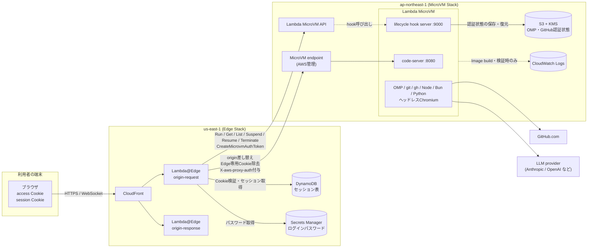
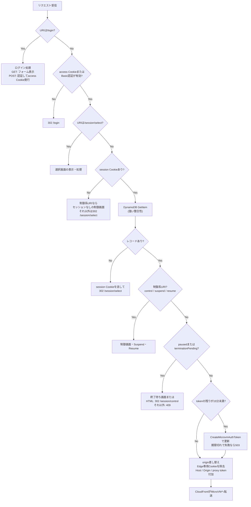
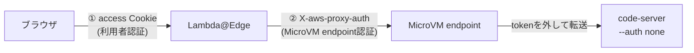
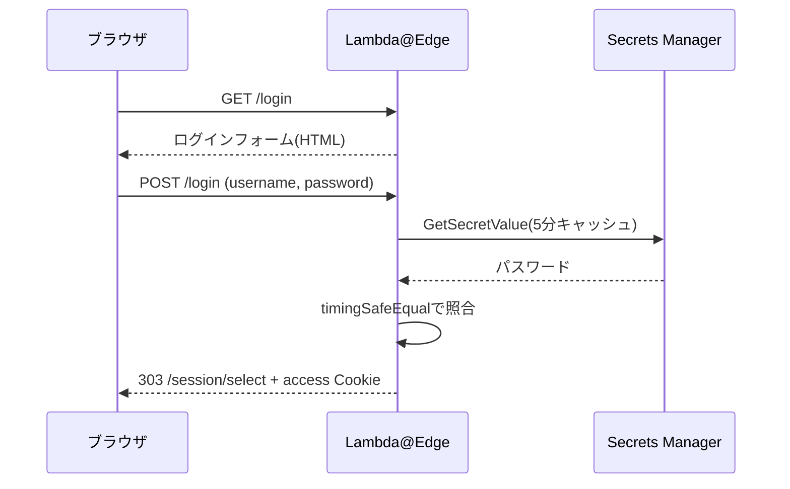
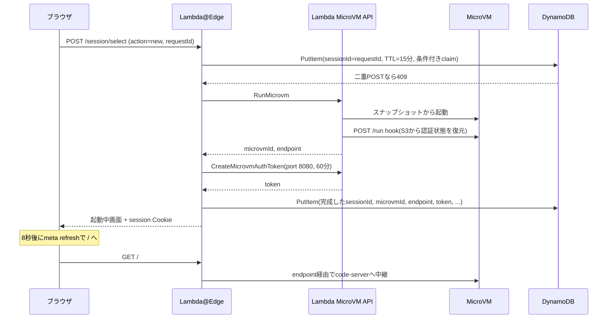
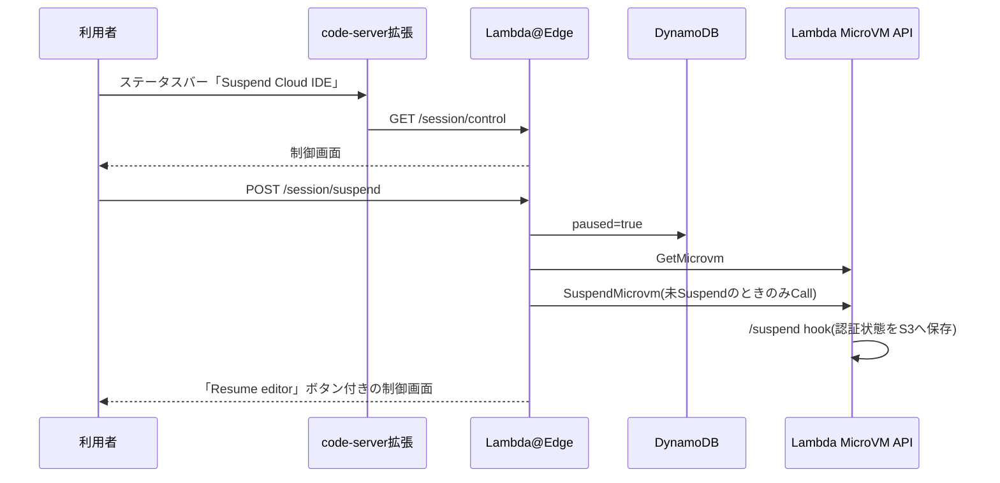
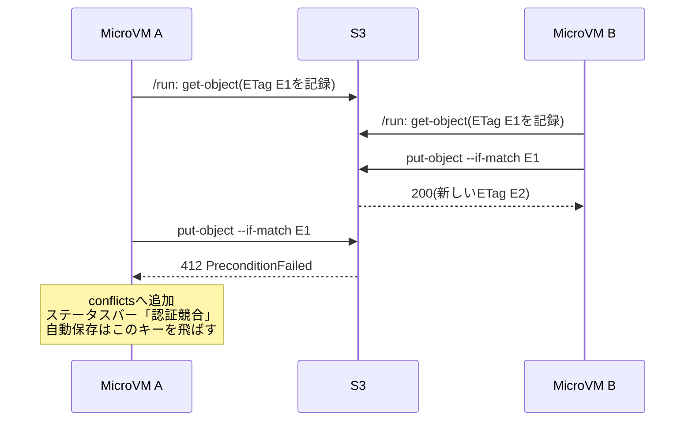

# OMP Cloud IDEアーキテクチャ設計書

最終更新: 2026-09-25
対象: `code-server/`配下の実装一式
想定読者: このシステムを引き継いで保守・改修する人。CloudFront、Lambda、IAM、HTTP Cookieの基本を知っている前提で書く。

## 0. この文書の読み方

### 0.1 3行でいうと

1. 利用者はCloudFrontのURLを開き、Lambda@Edgeが返すログインフォームでログインする。
2. Lambda@EdgeがAWS Lambda MicroVM(東京リージョン)を起動・再開し、CloudFrontの通信をMicroVM内のcode-serverへ中継する。
3. MicroVMは最大8時間で消えるので、OMPとGitHubの認証ファイルだけをS3へ退避し、ソースコードはGitHubへpushして残す。

### 0.2 目的別の参照先

| 知りたいこと | 読む章 |
| --- | --- |
| 全体像と各部品の役割 | 3章 |
| なぜこの構成にしたのか | 4章 |
| URLごとにLambda@Edgeが何をするか | 6章 |
| ログインとMicroVM endpointの認証 | 7章 |
| 新規作成・再接続・Suspend・Resume・Terminateの動き | 8章 |
| MicroVMの中に何が入っているか | 9章 |
| OMPとGitHubのログイン状態を引き継ぐ仕組み | 10章 |
| IAM権限 | 11章 |
| 何を守り、何を守れていないか | 12章 |
| デプロイ方法と使っているツール | 13章 |
| 既知の問題 | 16章 |

関連する資料として、`docs/session-management.md`がセッション管理の詳細を、`docs/lessons-learned.md`が開発中のハマりどころを、`docs/implementation-status-and-roadmap.md`が実装状況と改善計画を扱う。

## 1. システム概要

### 1.1 何をするシステムか

このシステムは、ブラウザから使う個人用のCloud IDEである。必要なときだけAWS Lambda MicroVMを起動し、その中で動くcode-server(ブラウザ版VS Code)を利用者へ提供する。code-serverのターミナルでは、コーディングエージェントのOMP(Oh My Pi)、git、GitHub CLI、Node.js、Bun、Python、AWS CLIなどを使える。

常時起動しているサーバーは存在しない。利用者が操作しない間、MicroVMはSuspend(一時停止)またはTerminate(終了)され、compute課金が止まる。

### 1.2 利用者から見た流れ

1. CloudFrontのURLを開くと、Lambda@Edgeがログインフォームを返す。
2. ユーザー名とパスワードでログインすると、セッション選択画面(`/session/select`)へ移動する。
3. 選択画面で、既存のMicroVMへ接続するか、新しいMicroVMを起動するかを選ぶ。
4. code-serverが開く。ターミナルで`omp`や`git`を使って開発する。
5. 作業を中断するときは、code-serverのステータスバーにある`Suspend Cloud IDE`から制御画面を開き、Suspendする。
6. 再開するときは、制御画面の`Resume editor`、または選択画面の`Resume and connect`を押す。

### 1.3 要件

- MicroVMと主要なデータ(認証状態のS3)は東京リージョン(`ap-northeast-1`)に置く。
- 常駐EC2を使わない。
- CloudFrontのURLを知っているだけではMicroVMを起動できない。
- GitHubにはOAuthで接続し、PAT(Personal Access Token)を使わない。
- OMPとGitHubのログイン状態を、MicroVMの終了後も次のMicroVMへ引き継ぐ。
- code-server、OMP、主要CLI、ヘッドレスブラウザをImageへ事前に入れておく。
- 利用者が明示的にSuspendできる。
- ブラウザのCookieを失っても、生きている既存MicroVMへ再接続できる。
- IaCはAWS CDK(TypeScript)で書き、デプロイにはOSSの`cdkd`を使う。

### 1.4 対象外

- 複数ユーザー向けのSaaS化
- 24時間起動し続けるVM
- MicroVM内のworkspaceの永続化
- GitHub Enterprise固有の対応
- 複数MicroVMが同時にOAuth tokenを更新したときの自動的な統合(上書きは防ぐが、競合を検出して止めるだけにする。10.5節)
- OMP Computer toolによるGUIデスクトップ操作

## 2. 用語

| 用語 | この文書での意味 |
| --- | --- |
| Lambda MicroVM | AWS Lambdaが提供する、VM単位で分離された実行環境。1台ごとに専用のHTTPS endpointを持ち、RUNNING・SUSPENDED合わせて最大8時間まで存続する |
| MicroVM Image | MicroVMの元になるイメージ。Dockerfileを実行してアプリを起動した状態のディスクとメモリをスナップショットとして保存したもの |
| MicroVM endpoint | MicroVMごとにAWSが払い出すHTTPSのURL。有効なproxy tokenがないリクエストは受け付けない |
| proxy token | `CreateMicrovmAuthToken`で発行するJWE形式のtoken。`X-aws-proxy-auth`ヘッダーで送る。許可するportと有効期限を持つ |
| lifecycle hook | MicroVMの起動・再開・停止・終了時に、AWSがMicroVM内のHTTP serverへPOSTする仕組み。このシステムではport 9000で受ける |
| Lambda@Edge | CloudFrontのリクエスト・レスポンスに割り込んで動くLambda。このシステムではorigin-requestとorigin-responseの2つを使う |
| セッション | ブラウザと1台のMicroVMの対応関係。DynamoDBの1レコードで表す |
| access Cookie | `omp-cloud-ide-auth`。ログイン済みであることを示す署名付きCookie |
| session Cookie | `mvm-session`。どのセッション(MicroVM)へ接続するかを示すCookie。中身はDynamoDBのキーになるUUID |
| paused | DynamoDBのフラグ。利用者が明示的にSuspendした状態を表し、trueの間はLambda@Edgeがエディタの通信を止める |
| OMP | Oh My Pi。npmパッケージ`@oh-my-pi/pi-coding-agent`として配布されるコーディングエージェントCLI |
| code-server | coder社が開発する、VS Codeをブラウザから使えるようにするサーバー |
| cdkd | CDKアプリをCloudFormationを経由せずAWS SDKで直接デプロイするOSSのCLI(`@go-to-k/cdkd`) |

## 3. 全体構成

### 3.1 構成図



### 3.2 コンポーネントと責務

| コンポーネント | 置き場所 | 責務 |
| --- | --- | --- |
| CloudFront | グローバル(Edge Stack) | ブラウザの唯一の入口。HTTPS化、セキュリティヘッダー付与、Lambda@Edgeの起動 |
| Lambda@Edge origin-request | us-east-1で定義し各地で実行 | ログイン、Cookie検証、セッション選択、MicroVMの起動・一時停止・再開・終了、proxy tokenの発行と更新、origin差し替え |
| Lambda@Edge origin-response | 同上 | MicroVMが一時的に502/504を返したとき、HTML画面だけを選択画面へ戻す |
| DynamoDB `omp-cloud-ide-sessions` | us-east-1 | セッションID、MicroVM ID、endpoint、proxy token、paused状態を保存する |
| Secrets Manager `omp-cloud-ide/access-password` | us-east-1 | ログインパスワード。access Cookieの署名鍵も兼ねる |
| MicroVM Image `omp-cloud-ide` | ap-northeast-1 | code-server、OMP、開発ツール、hook serverを含む実行イメージ |
| Lambda MicroVM | ap-northeast-1 | code-serverとOMPを動かす実行環境。1セッションにつき1台 |
| lifecycle hook server | MicroVM内のport 9000 | code-serverのヘルスチェック、認証状態の復元・保存 |
| S3 + KMS | ap-northeast-1 | OMPの`agent.db`、`install-id`、GitHub CLIの`hosts.yml`を暗号化して保存する |
| CloudWatch Logs | ap-northeast-1 | Image buildと検証用MicroVM(`/validate`)のログ。利用者が起動したMicroVMの標準出力は届かない |
| code-server拡張`har1101.omp-cloud-ide-controls` | MicroVM内 | ステータスバーに`Suspend Cloud IDE`、残り寿命(`残り H:MM`)、認証状態の保存状況(`認証 N分前`など)を出し、制御画面を開く・手動保存を実行する |

### 3.3 2リージョン・2スタックに分けた理由

CloudFrontに関連付けるLambda@Edgeは、`us-east-1`に置く必要がある(CloudFront開発者ガイド「Restrictions on Lambda@Edge」)。一方、MicroVMは利用者に近い東京リージョンで動かしたい。そこでCDKアプリを次の2スタックに分けた。

| スタック | リージョン | 含むもの |
| --- | --- | --- |
| `OmpCloudIdeMicrovmStack` | `ap-northeast-1` | MicroVM Image、KMS Key、S3 Bucket、Log Group、Build Role、Execution Role |
| `OmpCloudIdeEdgeStack` | `us-east-1` | CloudFront、Lambda@Edge 2つ、DynamoDB、Secrets Manager、Edge用IAM Role |

Edge StackはMicroVM Stackに依存する(`edgeStack.addStackDependency(microvmStack)`)。デプロイ時はMicroVM Stackが先に作られる。

2スタック間でCDKのcross-region参照は使わない。`lib/config.ts`がアカウントIDと固定の名前からImage ARN、Execution Role ARN、Bucket名を組み立て、両スタックが同じ値を参照する。

DynamoDBとSecrets ManagerをEdge側(`us-east-1`)に置いた理由は、Lambda@Edgeの処理のたびに呼ぶためである。

### 3.4 状態の置き場所

このシステムの状態は、寿命と役割が異なる6種類に分かれる。混ぜると「ログインは有効なのに接続先だけ失った」ような状態を扱えなくなるため、置き場所を分けている。

| 状態 | 内容 | 置き場所 | 寿命 |
| --- | --- | --- | --- |
| 利用者認証 | Cloud IDEを使ってよいブラウザか | access Cookie、Secrets Manager | 8時間 |
| 接続先 | どのMicroVMへ接続するか | session Cookie、DynamoDB | 8時間(TTLは+1時間) |
| MicroVM endpoint認証 | endpointへ通すためのtoken | DynamoDB(ブラウザには渡さない) | 60分、期限15分前から更新 |
| OMP・GitHubの認証 | LLM providerとGitHubのOAuth情報 | MicroVMのローカルとS3 | MicroVMを越えて存続 |
| 作業成果 | ソースコード、commit | GitHubリポジトリ | 恒久 |
| 実行中の状態 | メモリ、ローカルディスク、プロセス | MicroVM | MicroVMの寿命(最大8時間) |

## 4. 設計判断

各判断について、決めたこと・理由・その代わりに受け入れたことを書く。

### 4.1 常駐サーバーを置かない

- 決めたこと: CloudFront、Lambda@Edge、DynamoDB、S3、Secrets Managerというマネージドサービスだけで制御系を作る。computeはMicroVMだけにする。
- 理由: 個人用のIDEで常駐EC2やAuth Brokerを持つと、使わない時間の費用と運用(パッチ適用など)が大きい。
- 受け入れたこと: 認証情報を一元管理するサーバーがないため、複数MicroVMが同じ認証情報を更新すると競合し得る。S3の条件付き書き込みで他のVMの新しい状態を上書きしないようにしているが、自動では統合しない(10.5節)。

### 4.2 ブラウザにMicroVM endpointとproxy tokenを渡さない

- 決めたこと: ブラウザはCloudFrontのドメインだけを見る。MicroVM endpointとproxy tokenはDynamoDBに置き、Lambda@Edgeがリクエストごとに付ける。
- 理由: proxy tokenはMicroVMへの鍵そのものであり、ブラウザに置くとJavaScriptやログから漏れる経路が増える。CloudFrontを唯一の入口にすると、ログイン判定も1か所に集まる。
- 受け入れたこと: 通常のリクエストのたびにLambda@EdgeがDynamoDBを1回読む。

### 4.3 code-serverの認証を無効にし、前段の2層で守る

- 決めたこと: code-serverは`--auth none`で起動する。守りは「Lambda@Edgeのログイン」と「MicroVM endpointのproxy token」の2層で行う。
- 理由: MicroVM endpointはAWSの仕様で有効なtokenがないと一切通さない。そのtokenはLambda@Edgeだけが持つため、ログインを通過しない限りcode-serverへ到達できない。code-serverのパスワードを別に持つと、ログインが2回必要になる。
- 受け入れたこと: 将来、別の経路でcode-serverを公開する場合は必ず認証を戻す必要がある。

### 4.4 ログインや画面表示だけではMicroVMを起動しない

- 決めたこと: `RunMicrovm`を呼ぶのは、選択画面で`Start a new MicroVM`を押したPOSTだけにする。Suspend・ResumeもPOSTだけで受け付ける。
- 理由: 初期実装では、ログイン後に`/`を開くだけでMicroVMを新規起動していた。ブラウザの再訪やリロードで課金が始まり、既存MicroVMも孤立した。
- 受け入れたこと: 利用者は毎回選択画面で1クリック多く操作する。

### 4.5 SuspendをMicroVMの外(Lambda@Edge)から制御する

- 決めたこと: Suspendのボタンはcode-server拡張に置くが、実際の処理はLambda@Edgeの制御画面で行う。Lambda@EdgeはSuspend APIを呼ぶ前にDynamoDBの`paused`をtrueにし、以後のエディタ通信を止める。
- 理由: MicroVMは`autoResumeEnabled=true`で起動しているため、endpointへ通信が届くと自動で再開する。code-serverのタブを開いたままにするとWebSocketの再接続が届き、Suspend直後に再開してしまう。MicroVMの中から自分自身を止める方式では、応答途中で止まる問題もある。
- 受け入れたこと: Suspendには「ステータスバー → 制御画面 → ボタン」の2段階操作が必要になる。

### 4.6 認証ファイルだけを永続化し、作業成果はGitに任せる

- 決めたこと: S3へ保存するのはOMPの`agent.db`、`install-id`、GitHub CLIの`hosts.yml`の3ファイルだけにする。`/home/vscode/workspace`は保存しない。
- 理由: workspace全体を保存すると、容量、復元時間、secretの混入、複数MicroVM間の競合、費用の問題が一度に発生する。Gitを永続化の境界にすると責任範囲が明確になる。
- 受け入れたこと: 利用者はMicroVMが終了する前にcommitとpushをする必要がある。

### 4.7 開発ツールをImageへ焼き込む

- 決めたこと: code-server、OMP、Node.js、Bun、Python、uv、GitHub CLI、AWS CLI、LSP、Chromium、VS Code拡張をImage build時に入れ、主要ツールはversionを固定する。
- 理由: MicroVMは最大8時間の使い捨てなので、起動のたびにダウンロードすると時間がかかり、結果も毎回変わり得る。Imageはスナップショットから起動するため、事前に入れたツールは起動直後から使える。
- 受け入れたこと: ツールを更新するたびにImageの再buildが必要になる。

### 4.8 Cognitoを使わず、パスワードフォームとHMAC Cookieにする

- 決めたこと: Secrets Managerの自動生成パスワードでログインし、HMAC署名付きCookieを発行する。
- 理由: 利用者は1人であり、ユーザー管理やMFAより構成の小ささを優先した。
- 受け入れたこと: MFA、ユーザー識別、ログイン試行回数の制限、個別のログアウトがない。複数人で使う段階でCognitoなどのOIDCへ移行する。

### 4.9 通常のGitHubにGitHub CLIのOAuthで接続する

- 決めたこと: `gh auth login --web`で通常の`github.com`へOAuthログインし、gitの認証もGitHub CLIに任せる。
- 理由: PATを発行・配布・失効させる運用をなくすため。要件上、GitHub Enterprise固有の機能は不要だった。

## 5. AWSリソース

### 5.1 `OmpCloudIdeMicrovmStack`(ap-northeast-1)

| リソース | 名前 | 主な設定 | 削除時 |
| --- | --- | --- | --- |
| KMS Key | `alias/omp-cloud-ide-auth-state` | 自動ローテーション有効 | 残す(RETAIN) |
| S3 Bucket | `omp-cloud-ide-auth-<account>-ap-northeast-1` | SSE-KMS、Versioning、Block Public Access、SSL必須、旧versionのlifecycle rule(10.6節) | 残す(RETAIN) |
| CloudWatch Log Group | `/aws/lambda-microvms/omp-cloud-ide` | 保持1週間、削除保護。Image buildと検証用MicroVMの出力だけが入る | 残す(RETAIN) |
| S3 Asset | `artifact/base-image`をzip化 | Image buildの入力 | cdkdが管理 |
| IAM Role(Build) | `omp-cloud-ide-microvm-build` | Assetの読み取り、Log Groupへの書き込み | 削除 |
| IAM Role(Execution) | `omp-cloud-ide-microvm-execution` | S3の`personal/*`、KMS、Log Group | 削除 |
| MicroVM Image | `omp-cloud-ide` | ARM64、ベース`al2023-1`、最小メモリ2048MiB、hook port 9000 | 削除 |

MicroVM ImageにはCDKのL2 Constructがまだないため、`cdk.CfnResource`で`AWS::Lambda::MicrovmImage`を直接定義している(`lib/lambda-microvm-stack.ts`)。

### 5.2 `OmpCloudIdeEdgeStack`(us-east-1)

| リソース | 名前 | 主な設定 | 削除時 |
| --- | --- | --- | --- |
| Secrets Manager Secret | `omp-cloud-ide/access-password` | 32文字、記号なし | 削除 |
| DynamoDB Table | `omp-cloud-ide-sessions` | パーティションキー`sessionId`、オンデマンド、TTL属性`ttl` | 削除 |
| IAM Role(Edge) | 自動命名 | 11.1節 | 削除 |
| Lambda(origin-request) | 自動命名 | Node.js 24、256MiB、30秒 | 関数は削除、公開Versionは残す |
| Lambda(origin-response) | 自動命名 | Node.js 24、128MiB、5秒 | 関数は削除、公開Versionは残す |
| Response Headers Policy | `omp-cloud-ide-security-headers` | CSP、HSTS、nosniffなど | 削除 |
| CloudFront Distribution | 自動命名 | 5.3節 | 削除 |

Lambda@Edgeの公開VersionをRETAINにしている理由は、CloudFrontが各地へ複製したVersionを、切り替え直後には削除できないためである。削除しようとするとデプロイが失敗する。

### 5.3 CloudFrontの設定

| 設定 | 値 | 理由 |
| --- | --- | --- |
| origin | `example.com`(ダミー) | CDKがoriginの指定を必須とするため。実際の通信先はLambda@Edgeが差し替える |
| Viewer protocol | HTTPをHTTPSへリダイレクト | 平文を許さない |
| 許可メソッド | ALLOW_ALL | ログインフォームやSuspendのPOST、code-serverのAPIを通す |
| Cache policy | CachingDisabled | すべてが利用者ごとの動的な応答であるため |
| Origin request policy | AllViewerExceptHostHeader | Cookie、WebSocket関連ヘッダーをoriginへ渡す。HostはLambda@Edgeが設定する |
| HTTP version | HTTP/2とHTTP/3 | ブラウザとの通信を効率化する |
| Price class | PriceClass_200 | 日本を含むエッジを使う |
| origin-request | `includeBody: true` | ログインフォームと選択画面のPOST本文を読む |
| origin-response | `includeBody: false` | ステータスコードとヘッダーだけを見る |

### 5.4 削除時の挙動が非対称であること

`npm run destroy`を実行すると、S3、KMS、MicroVMのLog Group、Lambda@EdgeのVersionは残る一方、DynamoDBとSecretは消える。生きているMicroVMがある状態でdestroyすると、DynamoDBの対応関係を失い、そのMicroVMへ再接続できなくなる。Secretを作り直すとパスワードが変わり、既存のaccess Cookieもすべて無効になる。destroyの前に、稼働中のMicroVMを終了させておく。

## 6. Lambda@Edgeのリクエスト処理

### 6.1 origin-requestの処理順

`artifact/edge/index.js`の`handler`は、次の順で判定する。



### 6.2 URIごとの挙動

| URI | メソッド | ログイン要否 | 処理 |
| --- | --- | --- | --- |
| `/login` | GET, HEAD | 不要 | ログインフォームを返す。MicroVMは起動しない |
| `/login` | POST | 不要 | ユーザー名とパスワードを照合し、成功ならaccess Cookieを付けて`/session/select`へ303 |
| `/session/select` | GET, HEAD | 必要 | 既存セッションの一覧と新規作成ボタンを表示する |
| `/session/select` | POST `action=new` | 必要 | MicroVMを新規起動する(8.3節) |
| `/session/select` | POST `action=attach` | 必要 | 指定セッションへ接続し、必要ならResumeする(8.4節) |
| `/session/select` | POST `action=terminate-confirm` / `terminate` | 必要 | 追跡中のセッションを再照合し、ID全文入力で終了する(8.5節) |
| `/session/start` | すべて | 必要 | 旧経路。起動せず選択画面へリダイレクト |
| `/session/control` | GET | 必要 | Suspend・Resume・Terminateの制御画面を返す |
| `/session/suspend` | POST | 必要 | `paused=true`にしてからSuspendする(8.5節) |
| `/session/resume` | POST | 必要 | Resumeして`paused=false`に戻す(8.5節) |
| 上記以外 | すべて | 必要 | session CookieをもとにMicroVMのcode-serverへ中継する |

Lambda@Edgeが自分で返す画面(ログイン、選択、制御、起動中、再開中)には、すべて`Cache-Control: no-store`を付ける。起動中画面を除く画面には、厳しいCSPも付ける(7.5節)。

### 6.3 originの差し替え

通常のリクエストでは、Lambda@EdgeがCloudFrontのリクエストオブジェクトを次のように書き換えて返す。CloudFrontはこの書き換え後の宛先へ転送する。

```js
request.origin = {
  custom: {
    domainName: host,           // DynamoDBに保存したMicroVM endpoint
    port: 443,
    protocol: 'https',
    path: '',
    sslProtocols: ['TLSv1.2'],
    readTimeout: 60,
    keepaliveTimeout: 60,
  },
};
request.headers.host = [{ key: 'Host', value: host }];
request.headers['x-aws-proxy-auth'] = [{ key: 'X-aws-proxy-auth', value: token }];
request.headers.origin = [{ key: 'Origin', value: `https://${host}` }];
// access/session Cookieは認証判定後に取り除き、code-server固有Cookieは保持する。
stripEdgeCookies(request.headers);
```

`Origin`ヘッダーをendpointに合わせる理由は、code-serverがWebSocket接続時に`Origin`と`Host`の一致を確認するためである。

originを動的に差し替えられるのはorigin-requestイベントだけなので、このLambda@Edgeはorigin-requestに関連付けている。

code-serverのWebSocketも同じ経路を通る。WebSocketは最初にHTTPのupgradeリクエストを送るので、Lambda@Edgeはそのリクエストでoriginとtokenを設定する。

### 6.4 origin-response

`artifact/edge-response/index.js`は、次の3条件がすべてそろったときだけレスポンスを差し替える。

1. originの応答が502または504である
2. リクエストに`mvm-session` Cookieがある
3. `Accept`ヘッダーに`text/html`を含む(画面遷移である)

このとき、session Cookieを残したまま`/session/select`へ302で戻す。CSS、JavaScript、WebSocketなどの非HTMLの応答はそのまま返す。

この処理を入れた経緯は8.8節に書く。

### 6.5 設定値の埋め込み

Lambda@Edgeは環境変数を使えない。そこで、CDKのsynth時に`OmpCloudIdeEdgeStack`が`artifact/edge/config.json`を書き出し、関数のコードと一緒にバンドルする。

`config.json`に入れるのは、リージョン、テーブル名、Image ARN、Role ARN、Secretの名前、Cookie名、各種の秒数など、秘密でない値だけである。パスワードは実行時にSecrets Managerから取得する。CDKのtoken(未解決の値)を書き込むとアセットのハッシュが安定しないため、固定の名前を使う。

`config.json`は生成物であり、Gitで管理しない。

## 7. 認証設計

### 7.1 2層の構造



| 層 | 誰が検証するか | 何を検証するか | ブラウザが持つか |
| --- | --- | --- | --- |
| ① 利用者認証 | Lambda@Edge | access Cookieの署名と期限 | 持つ |
| ② MicroVM endpoint認証 | AWS(MicroVM endpoint) | proxy tokenの対象MicroVM、port、期限 | 持たない |

### 7.2 第1層: 利用者認証

#### ログインの流れ



ログインが成功しても、Lambda@Edgeは`RunMicrovm`を呼ばない。

#### access Cookieの仕様

| 項目 | 内容 |
| --- | --- |
| 名前 | `omp-cloud-ide-auth` |
| 値 | `<有効期限のUNIX秒>.<署名>` |
| 署名 | HMAC-SHA256。鍵はログインパスワード、入力は`omp-cloud-ide:<有効期限>`、出力はbase64url |
| 寿命 | 8時間(`Max-Age=28800`) |
| 属性 | `Path=/; Secure; HttpOnly; SameSite=Strict` |

Lambda@Edgeは次の順で検証する。

1. 値を最初の`.`で分け、有効期限を整数として読む。
2. 有効期限が現在時刻より前なら拒否する。
3. 有効期限が「現在時刻 + 8時間 + 60秒」より先なら拒否する。署名が正しくても、設定より長い寿命のCookieは受け付けない。
4. 署名を再計算し、`timingSafeEqual`で比較する。

パスワードそのものはCookieに入らない。パスワードを変更すると署名鍵も変わるため、発行済みのaccess Cookieはすべて無効になる。Lambda@Edgeはパスワードを実行環境ごとに5分間キャッシュするので、変更直後は最大5分の移行時間がある。

#### Basic認証を残している理由

ブラウザ向けにはHTMLフォームを使う。以前はHTTP Basic認証のダイアログを使っていたが、一部の埋め込みブラウザでダイアログが一瞬で閉じる問題があり、フォームへ移行した。`Authorization: Basic`ヘッダーは、ブラウザ以外からの疎通確認用に今も受け付ける。Lambda@Edgeは検証後にこのヘッダーを削除してから転送する。

### 7.3 第2層: MicroVM endpoint認証

AWSのLambda MicroVM開発者ガイド「Networking」によると、MicroVM endpointへのリクエストはすべて`X-aws-proxy-auth`ヘッダーの有効なtokenを必要とし、認証なしで通す設定は存在しない。tokenは対象MicroVM、許可するport、有効期限を持つJWEである。

| 項目 | このシステムの設定 |
| --- | --- |
| 発行API | `CreateMicrovmAuthToken` |
| 許可port | 8080だけ |
| 有効期限 | 60分 |
| 更新タイミング | 残り15分未満になったリクエストで更新 |
| 保存先 | DynamoDBの`token`と`tokenExpiry` |
| 付与する主体 | Lambda@Edge |

同じ開発者ガイドによると、Lambdaは`X-aws-proxy-*`ヘッダーをアプリへ転送する前に取り除く。したがってcode-serverもtokenを受け取らない。

tokenの更新に失敗した場合、Lambda@Edgeはエラー名だけをログに出し、既存のtokenで処理を続ける。既存tokenが失効していれば、MicroVM endpointが403を返す。

### 7.4 code-server

code-serverは`--auth none`、`--bind-addr 0.0.0.0:8080`で起動する。認証を無効にしてよい理由は4.3節のとおりである。

MicroVM内で`localhost:3000`などに開発中のアプリを起動した場合、利用者はcode-serverの`/proxy/3000/`経由でアクセスする。外部からの入口は常にport 8080のcode-serverであり、proxy tokenも8080だけを許可している。

### 7.5 セキュリティヘッダー

CloudFrontのResponse Headers Policyが、すべての応答に次を付ける。

- HSTS(365日、includeSubDomains、preload)
- `X-Content-Type-Options: nosniff`
- `X-Frame-Options: SAMEORIGIN`
- `Referrer-Policy: no-referrer`
- `X-XSS-Protection: 1; mode=block`
- code-serverが動く範囲のCSP(`override: false`なので、code-serverが自分のCSPを返した場合はそちらを優先する)

Lambda@Edgeが自分で返すログイン画面、選択画面、制御画面には、さらに厳しいCSPを付ける。再開中画面は`form-action`を除いた同等のCSPを付ける。新規起動時の起動中画面(`startSession`の応答)には、Lambda@Edge側ではCSPを付けていない。

```text
default-src 'none'; style-src 'unsafe-inline'; form-action 'self'; base-uri 'none'; frame-ancestors 'none'
```

制御画面(`/session/control`)だけは、code-serverのタブ内で開くために`frame-ancestors 'self'`にしている。

このCSPはscriptを一切許可しない。CloudFront側のCSPもinline scriptを許可しない。そのため、起動中・再開中の画面は`<meta http-equiv="refresh">`でエディタへ遷移し、選択画面や制御画面の操作は通常のHTMLフォームのPOSTで行う。起動中画面がinline scriptを使わないことはJestのテストで確認している。画面に埋め込むMicroVM IDやstateなどの値は、すべて`escapeHtml`を通す。

## 8. セッション管理

### 8.1 DynamoDBのレコード

| 属性 | 型 | 内容 |
| --- | --- | --- |
| `sessionId` | String | パーティションキー。`randomUUID()`で生成し、session Cookieに入れる |
| `microvmId` | String | Lambda MicroVMのID |
| `endpoint` | String | MicroVM endpointのホスト名 |
| `token` | String | proxy token(`X-aws-proxy-auth`の値) |
| `tokenExpiry` | Number | tokenの失効時刻(ミリ秒) |
| `createdAt` | Number | 作成時刻(ミリ秒) |
| `paused` | Boolean | 利用者が明示的にSuspendした状態か |
| `ttl` | Number | DynamoDBのTTL(秒)。作成時刻 + 8時間 + 1時間 |

session Cookie(`mvm-session`)はこのレコードを指すUUIDだけを持つ。endpointとtokenはサーバー側に置いたままになる。

### 8.2 MicroVMの状態とLambda@Edgeの挙動

MicroVMの状態はAWS側の`state`とDynamoDBの`paused`の組み合わせで決まる。

| AWSの`state` | `paused` | エディタへの通信 | 選択画面のボタン |
| --- | --- | --- | --- |
| RUNNING | false | 中継する | `Connect` |
| RUNNING | true | 止める(Suspend処理中) | `Resume and connect` |
| SUSPENDED | false | 中継する(アイドルによる自動Suspend。通信が届くとAWSが自動で再開する) | `Resume and connect` |
| SUSPENDED | true | 止める(明示Suspend) | `Resume and connect` |
| SUSPENDING | どちらでも | `paused`に従う | 接続時に「Suspend中なので待って」と表示 |
| PENDING / その他 | どちらでも | `paused`に従う | `Connect`(準備完了は保証しない) |
| TERMINATING / TERMINATED / 存在しない | どちらでも | 接続できない | 一覧に表示しない |

### 8.3 新規作成



`RunMicrovm`のパラメータは次のとおり。

| パラメータ | 値 | 意味 |
| --- | --- | --- |
| `imageIdentifier` | `omp-cloud-ide`のImage ARN | 起動元のImage |
| `executionRoleArn` | `omp-cloud-ide-microvm-execution` | MicroVM内で使うIAM Role |
| `ingressNetworkConnectors` | `ALL_INGRESS` | endpoint経由の受信を許可する |
| `egressNetworkConnectors` | `INTERNET_EGRESS` | インターネットへの送信を許可する |
| `idlePolicy.autoResumeEnabled` | true | Suspend中に通信が届いたら自動で再開する |
| `idlePolicy.maxIdleDurationSeconds` | 300 | 5分間通信がなければ自動でSuspendする |
| `idlePolicy.suspendedDurationSeconds` | 28800 | Suspendが8時間続いたら終了する |
| `maximumDurationInSeconds` | 28800 | RUNNINGとSUSPENDEDを合わせた総寿命。8時間で終了する |
| `runHookPayload` | `{"sessionId": "<UUID>", "expiresAt": <epoch ms>}` | `/run` hookへ渡す文字列。`expiresAt`は`RunMicrovm`直前の時刻+8時間で、実際の終了時刻より遅くならない |

`maximumDurationInSeconds`はSuspend中の時間も含む。`suspendedDurationSeconds`が8時間でも、起動から8時間たてばMicroVMは終了する。

`RunMicrovm`、`CreateMicrovmAuthToken`、DDB保存は別々のAPI呼び出しである。後続失敗時は起動したIDに`TerminateMicrovm`を要求し、補償まで失敗したVMはchooserの`ListMicrovms`照合で「Untracked MicroVMs」に表示する。起動中の一時的な不整合と区別できないため、untrackedの画面内Terminateは提供しない。IDを確認してAWS API/Consoleで手動処理する。

### 8.4 既存セッションへの接続

#### 一覧の作り方

`GET /session/select`で、Lambda@Edgeは次を行う。

1. DynamoDBを`Limit: 25`で全ページScanする。`sessionId`、`microvmId`、`paused`、`terminationPending`、`createdAt`、`ttl`だけを取得し、endpointとtokenは読まない。
2. 各レコードについて`GetMicrovm`を並列に呼ぶ。
3. `TERMINATED`またはNotFoundなら対象ID一致を条件に行を削除し、`TERMINATING`や照会失敗は表示から外す。
4. `createdAt`の新しい順に並べる。
5. MicroVMごとに接続と確認付きTerminateのフォームを置く。`terminationPending=true`なら接続フォームは出さない。終了予定時刻と残り時間も表示する。
6. 対象Imageの`ListMicrovms`を全ページ照会し、セッション行のない稼働中VMを「Untracked MicroVMs」へ表示する(画面内の終了ボタンはない)。

全ページを読むが、候補数が増えると並列`GetMicrovm`とEdgeの30秒timeoutが課題になる。新しい順はScanに保証されず、表示時に並べ直している。

#### 選んだときの処理

`POST /session/select`(`action=attach`)で、Lambda@Edgeは次を行う。

1. `sessionId`が16進数とハイフンからなる36文字かを確認する。
2. DynamoDBを強い整合性で読み直す。
3. `GetMicrovm`で現在の状態を確認し、状態ごとに分岐する。

| 状態 | 応答 |
| --- | --- |
| TERMINATED / TERMINATING | 410。選択画面に「終了済み」と表示 |
| SUSPENDING | 409。選択画面に「少し待って再試行」と表示 |
| SUSPENDED | `ResumeMicrovm`を呼び、`paused=false`にして、再開中画面とsession Cookieを返す |
| それ以外 | `paused=false`にして、session Cookieを付けて`/`へ303 |

session Cookieを選んだセッションのIDで上書きすることが、接続先の切り替えそのものである。別のブラウザや別の端末からでも、ログインさえすれば同じMicroVMへ接続できる。

### 8.5 明示的なSuspend・Resume・Terminate

#### Suspend



Lambda@Edgeは`paused=true`を先に書く。この順番により、Suspend要求の直後にcode-serverのWebSocketが再接続してきても、Lambda@EdgeがMicroVM endpointへ届く前に止める。

`paused=true`の間、Lambda@Edgeはエディタ宛てのリクエストに次を返す。

- HTMLの画面遷移: `/session/control`へ302
- WebSocket、API、静的ファイルなど: `409 Conflict`と`Retry-After: 5`

Suspend APIが失敗した場合、Lambda@Edgeは`paused=false`へ戻し、エラー付きの制御画面を返す。

#### Resume

制御画面の`POST /session/resume`で、Lambda@Edgeは次を行う。

1. `GetMicrovm`で状態を確認する。
2. SUSPENDEDなら`ResumeMicrovm`を呼ぶ。SUSPENDINGなら「待って再試行」を表示して終わる。
3. `paused=false`へ戻す。
4. 5秒後に`/`へ遷移する再開中画面を返す。

AWSの開発者ガイドによると、Resume時にMicroVMのメモリとディスクはSuspend時点の状態に戻る。ターミナルで動いていたプロセスやOMPのセッションも、そのまま続きから使える。

#### Terminate

選択画面・制御画面の終了ボタンは、追跡中セッションのMicroVM IDとImage ARNを`GetMicrovm`で再確認し、ID全文を入力する確認画面を経て実行する。DDBに`terminationPending=true`と`paused=true`を対象ID一致条件で書いて通信・再接続を止めてから`TerminateMicrovm`を呼ぶ。APIの結果が不明なら遮断を維持し、稼働中なら選択画面から再試行できる。成功時に現在のsession Cookieを失効させる。

終了済み(`TERMINATED`またはNotFound)と確認した時点でだけ、対象ID一致の条件付き`DeleteItem`で行を削除する。`TERMINATING`中は行を残し、選択画面の次の照合で片付ける。`/terminate` hookでの認証保存はfail-openなので、API完了が保存成功を意味しない。未commitの作業は事前にGitへpushする。

### 8.6 アイドルによる自動Suspendとの関係

MicroVMはidle policyにより、endpointへの通信が5分間なければAWSが自動でSuspendする。この場合`paused`はfalseのままなので、次に利用者がURLを開くとLambda@Edgeは通常どおり中継し、AWSが自動でResumeしてからリクエストを届ける。

code-serverのタブを開いたままにすると通信が続き、アイドル扱いにならない。作業を終えるときは明示的にSuspendする運用にしている。

### 8.7 tokenの更新

Lambda@Edgeは、通常のリクエストのたびにDynamoDBの`tokenExpiry`を見る。残りが15分未満なら`CreateMicrovmAuthToken`で新しいtokenを発行し、DynamoDBを更新する。更新失敗時も旧tokenがまだ有効なら続行するが、失効済みなら503を返しoriginへ転送しない。更新には条件式を付けていないため、複数のエッジで同時に更新が走った場合の挙動は未検証である。

### 8.8 一時的な502/504からの復帰

MicroVM endpointは、ResumeやMicroVM起動の途中で一時的に502や504を返すことがある。初期のorigin-responseは、この応答を「MicroVMが消えた」と判断してsession Cookieを削除し、新規起動の経路へ送っていた。その結果、MicroVMは生きているのにブラウザからは見えなくなった。

現在のorigin-responseはsession Cookieを残し、選択画面へ戻すだけにしている。選択画面は`GetMicrovm`で実際の状態を確認するので、利用者は同じMicroVMへ接続し直せる。

判定はpathを限定していないため、`/proxy/<port>/`の開発アプリ自身が返したHTMLの502も選択画面へ戻してしまう(16章)。

## 9. MicroVM Image

### 9.1 基本設定

| 項目 | 値 |
| --- | --- |
| MicroVMのベースイメージ | `arn:aws:lambda:ap-northeast-1:aws:microvm-image:al2023-1`、version 1 |
| DockerfileのFROM | `public.ecr.aws/lambda/microvms:al2023-minimal` |
| アーキテクチャ | ARM64 |
| 最小メモリ | 2048MiB(AWSの説明では2GB/1vCPUがベースライン、ピーク時は4倍まで伸びる) |
| 実行ユーザー | `vscode`(UID/GID 1000の一般ユーザー) |
| workspace | `/home/vscode/workspace` |
| OMPの設定ディレクトリ | `/home/vscode/.omp/agent`(`PI_CODING_AGENT_DIR`) |
| hook port | 9000 |
| 公開port | 8080(code-server) |

### 9.2 Imageのビルドとスナップショット

AWSのLambda MicroVM開発者ガイド「MicroVM images」によると、Image buildは次の順で進む。

1. S3からzip(このシステムでは`artifact/base-image`)を取得する。
2. ベースイメージからMicroVMを起動し、Dockerfileを実行する。
3. `CMD`でアプリを起動する。
4. `/ready` hookが200を返したら、ディスクとメモリのスナップショットを取る。
5. 作成したImageから別のMicroVMを起動し、`/validate` hookで動作を確認する。

このシステムでは、`CMD`で起動した`start-cloud-ide`がcode-serverとhook serverを立ち上げる。`/ready`はcode-serverの`/healthz`が200を返すまで503を返す。つまり、スナップショットにはcode-serverが起動済みの状態が入る。`RunMicrovm`はこのスナップショットから再開するため、code-serverの起動を待たずに使い始められる。

Image定義にも`INTERNET_EGRESS`を指定している。Dockerfileの実行中にGitHub Releasesやnpmからツールをダウンロードするためである。

### 9.3 導入しているツール

| ツール | version | 取得元 | 検証 |
| --- | --- | --- | --- |
| code-server | 4.126.0 | coder/code-server GitHub Releases(RPM) | versionのみ |
| Node.js | 24.21.0 | nodejs.org | versionのみ |
| Bun | 1.3.14 | oven-sh/bun GitHub Releases | versionのみ |
| OMP(`@oh-my-pi/pi-coding-agent`) | 18.2.11 | npm(`bun install --global`) | versionのみ |
| GitHub CLI | 2.96.0 | cli/cli GitHub Releases | versionのみ |
| AWS CLI | 2.34.45 | awscli.amazonaws.com | versionのみ |
| uv / uvx | 0.12.18 | astral-sh/uv GitHub Releases | versionのみ |
| ripgrep | 15.2.0 | BurntSushi/ripgrep GitHub Releases | SHA-256 |
| Chromium(Sparticuz arm64 pack) | 149.0.0 | Sparticuz/chromium GitHub Releases | SHA-256、build時に`--version`を実行 |
| TypeScript | 7.0.2 | npm | versionのみ |
| typescript-language-server | 6.0.0 | npm | versionのみ |
| Pyright | 1.1.414 | npm | versionのみ |
| bash-language-server | 5.8.1 | npm | versionのみ |
| yaml-language-server | 1.24.0 | npm | versionのみ |

このほか`dnf`でgit、python3、pip、jq、tree、zip系などを入れている。`dnf`のパッケージ、VS Code拡張、ベースイメージ、npmの依存先はversionを固定していない。

### 9.4 起動プロセス

`start-cloud-ide.sh`は次の2つを起動する。

```bash
python3 /opt/cloud-ide/lifecycle.py &

exec code-server \
  --bind-addr 0.0.0.0:8080 \
  --auth none \
  --disable-telemetry \
  --user-data-dir /home/vscode/.vscode \
  --extensions-dir /home/vscode/.local/share/code-server/extensions \
  /home/vscode/workspace
```

### 9.5 lifecycle hook

hookの有効化とtimeoutはImage定義(`Hooks`プロパティ)で設定し、処理は`lifecycle.py`が行う。パスは`/aws/lambda-microvms/runtime/v1/<hook名>`である。

| hook | 呼ばれるとき | timeout | `lifecycle.py`の処理 |
| --- | --- | --- | --- |
| `/ready` | Image build中、CMD起動後 | 120秒 | code-serverの`/healthz`が200なら200、そうでなければ503 |
| `/validate` | Image build後の検証用MicroVM | 30秒 | `/ready`と同じ |
| `/run` | MicroVM起動時。この応答までendpointは通信を流さない | 30秒 | 終了予定時刻を記録し、S3から認証状態を復元して200(復元は25秒以内。失敗しても200) |
| `/resume` | Resume時 | 10秒 | 何もせず200 |
| `/suspend` | Suspend前 | 45秒 | 前回から変わった認証状態をS3へ保存して200(40秒以内。失敗しても200) |
| `/terminate` | 終了前 | 45秒 | `/suspend`と同じ |

`/run`のリクエスト本文には、Lambdaが注入する`microvmId`と、Lambda@Edgeが渡した`runHookPayload`(`{"sessionId": ..., "expiresAt": ...}`という文字列)が入る。`lifecycle.py`は`expiresAt`と`microvmId`を`~/.cache/omp-cloud-ide/session.json`へ書く。MicroVM内には自分の`startedAt`を取得する手段(`GetMicrovm`権限や環境変数)がないため、Edgeから期限を渡す。bearer Cookie値である`sessionId`は保存しない。

hook serverは5分ごとの定期保存スレッドも動かす。定期保存は前回から変わったファイルだけをアップロードする。期限、ロック、失敗時の扱いは10.3節に書く。

`lifecycle.py`は`[lifecycle]`で始まるログを標準出力へ書くが、利用者が起動したMicroVMの標準出力はCloudWatch Logsに届かない。`/aws/lambda/microvms/omp-cloud-ide`と`/aws/lambda-microvms/omp-cloud-ide`に残るのは、Image buildと検証用MicroVMの出力だけである。hookの結果はMicroVM内の`~/.cache/omp-cloud-ide/auth-sync.json`と、それを表示するステータスバーで確認する(10.4節)。

### 9.6 code-serverの設定と拡張

`settings.json`の主な設定:

| 設定 | 値 | 理由 |
| --- | --- | --- |
| `telemetry.telemetryLevel` | off | 送信を止める |
| `files.autoSave` | afterDelay | 保存忘れを防ぐ |
| `security.workspace.trust.enabled` | false | 信頼確認のダイアログを出さない(12章の前提に関係する) |
| `chat.disableAIFeatures` | true | VS Code組み込みのAI機能を使わず、OMPに集約する |
| `ompCloudIde.controlUrl` | CloudFrontの`/session/control` | Suspend拡張が開くURL |
| `ompCloudIde.timeZone` | `Asia/Tokyo`(拡張の既定値) | 残り寿命tooltipの終了時刻表示 |

表示言語は`argv.json`の`{"locale":"ja"}`で日本語にしている。

Image build時に入れる拡張:

- `ms-ceintl.vscode-language-pack-ja`
- `redhat.vscode-yaml`
- `ms-python.python`
- `ms-azuretools.vscode-docker`
- `har1101.omp-cloud-ide-controls`(自作。`artifact/base-image/omp-cloud-ide-controls/`)

自作拡張は起動時にステータスバーへ次の3つを表示する。拡張自身はAWSの権限を持たない。

| 表示 | 読むもの | クリックしたとき |
| --- | --- | --- |
| `Suspend Cloud IDE` | `ompCloudIde.controlUrl` | `vscode.open`で制御画面を開く。URLがHTTPSでなければエラーを表示して開かない |
| `残り H:MM` | `~/.cache/omp-cloud-ide/session.json`の`expiresAt` | ソース管理ビューを開く |
| `認証 N分前`など | `~/.cache/omp-cloud-ide/auth-sync.json` | コマンド`ompCloudIde.persistAuthState`(「OMP Cloud IDE: Save Auth State to S3」)で`persist-auth-state`を実行し、結果を通知する |

残り寿命は30分以下で警告色、10分以下でエラー色にする。60/15/5分を切ったときに未commit・未push確認の通知を1回ずつ出し、通知からソース管理を開ける(遅れて開いた場合は最も近い閾値だけ)。終了予定時刻を過ぎると`寿命到達`と表示する。ファイルがないVMでは推測せず`残り時間不明`と表示する。

MicroVMのゲスト時計はNTPで同期していないため、Suspend/Resumeで時計が遅れる可能性に備えて、S3 regional endpointへの`HEAD`の`Date` headerで毎分とwindow focus時に時計差を補正する。2026-09-25の実測では、3分間Suspendしてから再開した後の補正量は-1秒で、ゲスト時計の遅れは観測されなかった。

認証状態の表示の意味は10.4節に書く。

`ompCloudIde.controlUrl`には特定のCloudFrontドメインが書き込まれている。Distributionを作り直すとSuspendボタンが古いURLを開く(16章)。

### 9.7 OMPの設定

`omp-config.yml`を`~/.omp/agent/config.yml`へ配置する。

| 設定 | 値 |
| --- | --- |
| `modelRoles` | default: `openai-codex/gpt-5.6-sol:high`、slow: `anthropic/claude-opus-5-5:max`、plan: `anthropic/claude-opus-5-5:high`、smol・advisor: `opencode-go/deepseek-v4-flash` |
| `retry.fallbackChains` | 役割ごとに別providerのモデルへフォールバックする |
| `tools.approvalMode` | `yolo`(ツール実行の承認を求めない) |
| `bash.patterns` | `rm -rf *`と`git push --force*`を拒否する |
| `goal` | 有効(interactiveで継続) |
| `ask` | 有効 |
| `browser` | 有効、headless、スクリーンショットは`/home/vscode/workspace/.artifacts/screenshots` |

`bash.patterns`はOMPのbashツールが実行前に照合する承認ルールである。パターンを回避したコマンドや子プロセスを、OSのレベルで止める仕組みは持たない。

### 9.8 ヘッドレスChromium

OMPのブラウザ機能はpuppeteer-coreを使い、初回利用時にChrome for Testingをダウンロードしようとする。開発時はLinux arm64向けのChrome for Testingが配布されておらず、ARM64のMicroVMではこのダウンロードに頼れなかった(Dockerfileのコメントに経緯がある)。

そこでImage build時に、Sparticuz/chromiumのarm64 packを`@sparticuz/chromium-min`で`/opt/chromium`へ展開している。

2026-09-25時点のChrome for Testingの配布一覧(`known-good-versions-with-downloads.json`)を見ると、`linux-arm64`の配布物は153.0.8001.0以降にだけ存在する。今回採用したSparticuzのChromium 149と同世代のChrome for Testingには含まれていない。Chromiumを更新するときは、Chrome for Testingへ切り替える案も比較する。その場合はAL2023 minimalに不足する共有ライブラリを`dnf`で入れる必要がある。比較の観点と完了条件は`docs/implementation-status-and-roadmap.md`の5.9.1節にある。

| 環境変数 | 値 | 役割 |
| --- | --- | --- |
| `PUPPETEER_EXECUTABLE_PATH` | `/opt/chromium/chromium` | puppeteerが起動するbinary |
| `FONTCONFIG_PATH` | `/opt/chromium/fonts` | フォント設定 |
| `LD_LIBRARY_PATH` | `/opt/chromium/al2023/lib:/opt/chromium` | AL2023向けの共有ライブラリ |

build時は`AWS_EXECUTION_ENV=AWS_Lambda_nodejs24.x`と`TMPDIR=/opt/chromium`を付けて展開する。`@sparticuz/chromium-min`は`AWS_EXECUTION_ENV`を見てAL2023用ライブラリを展開するかを決め、`TMPDIR`(Node.jsの`os.tmpdir()`)を展開先に使うためである。

## 10. 認証状態の永続化

### 10.1 対象ファイル

| S3キー(`s3://<bucket>/personal/`以下) | MicroVM内のパス | 中身 |
| --- | --- | --- |
| `omp/agent.db` | `~/.omp/agent/agent.db` | OMPのSQLite DB。AnthropicやOpenAI CodexなどのOAuth情報を含む |
| `omp/install-id` | `~/.omp/install-id` | OMPのインストールID |
| `github/hosts.yml` | `~/.config/gh/hosts.yml` | GitHub CLIのログイン情報 |

GitHub CLIは通常OSのcredential storeへtokenを保存し、credential storeが見つからない場合は平文ファイルへ書き込む(GitHub CLI manual「gh auth login」)。このImageにはcredential storeを入れていないため、tokenは`hosts.yml`に入る。gitの認証は`git config --system credential.https://github.com.helper '!gh auth git-credential'`でGitHub CLIへ委譲している。

### 10.2 保存と復元のタイミング

| タイミング | 処理 | 期限 |
| --- | --- | --- |
| `/run` hook | S3の3ファイルを同時に取得し、各objectのETag(objectがなければ「なし」)を記録する | 25秒 |
| 5分ごと | 前回確認した内容から変わったファイルだけをS3へ保存する。ロックが使用中ならその回は飛ばす | 120秒 |
| `/suspend` hook | 変わったファイルだけを保存する | 40秒 |
| `/terminate` hook | 同上 | 40秒 |
| `persist-auth-state`コマンド、またはステータスバーの認証表示のクリック | 利用者が手動で保存する。OMPや`gh`へログインした直後に使う | 120秒 |

hookの期限は、Image定義のtimeout(`/run` 30秒、`/suspend`・`/terminate` 45秒)に対して、HTTP応答を返す余裕を残した値である。

`/run` hookが200を返すまでMicroVM endpointは通信を流さないため、code-serverが最初のリクエストを受ける時点で認証状態の復元は終わっている。復元に失敗しても`/run`は200を返すので、その場合MicroVMは未ログインの状態で起動する(10.3節)。

### 10.3 実装の要点

- `agent.db`は動作中のOMPが書き込んでいる可能性がある。そのままコピーすると壊れたDBを保存し得るため、Pythonの`sqlite3.Connection.backup()`で一時ファイルへ整合性のある複製を作ってからアップロードする。
- 復元時は、対象と同じディレクトリの一時ファイルへダウンロードし、権限を`0600`にしてから`os.replace`で置き換える。途中で失敗しても既存ファイルを半端に上書きしない。
- S3操作はAWS CLIの`aws s3api get-object`と`aws s3api put-object`で行い、応答のETagとVersionIdを記録する。`/run`では3つの`get-object`を並列に開始し、1つ目の遅延が後続ファイルの時間枠を奪わないようにする。各呼び出しは「25秒」と「共通deadlineまでの残り時間」の短い方でtimeoutし、全件が終わってから復元結果を記録する。保存の`put-object`は従来どおり逐次実行する。
- 保存の前に、複製したファイルのSHA-256を前回確認した値(復元時または前回保存時)と比べ、同じならアップロードしない。定期保存、hook、手動保存のどれでも同じである(`--overwrite`だけは比較せずに書く)。
- fail-openにしている。hookは保存・復元の成否に関係なく必ず200を返し、MicroVMの起動・Suspend・終了を止めない。結果は`~/.cache/omp-cloud-ide/auth-sync.json`へ記録する(10.4節)。

#### ロックとhookの優先

hook serverのスレッド(hookと定期保存)と、別プロセスとして動く`persist-auth-state`は、`~/.cache/omp-cloud-ide/auth-sync.lock`に対する`fcntl.flock`で直列化する。

- 定期保存はロックを待たない。使用中ならその回を飛ばす。
- hookと手動保存は期限までロックを待つ。
- hookがロックを待っている間、定期保存は新しく始まらず、実行中の定期保存はAWS CLIのプロセスをkillして中断する。定期的な処理のせいでSuspendやTerminateの保存が期限切れにならないようにするためである。
- 複数のhookが同時に走った場合でも、実行中のhookの数を数え、最後のhookが終わるまで定期保存への中断の合図を消さない。

#### 復元に失敗したとき

- objectが存在しない(`NoSuchKey`)のは初回起動時の正常な状態であり、失敗として扱わない。そのキーは「objectなし」として記録する。
- それ以外の理由(S3やKMSの障害、timeoutなど)で復元に失敗したキーは`restoreFailed`へ入れる。自動保存(定期保存とhook)はそのキーをアップロードしない。未ログインのままのローカルファイルで、S3にある正しい認証状態を上書きしないためである。
- 利用者がログインし直してから手動保存すると、そのキーは保存され、`restoreFailed`から外れる。

### 10.4 保存結果の記録と表示

`lifecycle.py`は、復元・保存を試すたびに`~/.cache/omp-cloud-ide/auth-sync.json`をロックを持ったまま書き換える(一時ファイルからの`os.replace`)。

| 項目 | 内容 |
| --- | --- |
| `files.<S3キー>` | 最後に確認したS3 objectの`sha256`、`etag`、`versionId`と、保存した時刻`savedAt`。`/run`時にobjectがなかったキーは`missing` |
| `lastTrigger` | 最後の処理(`run`、`periodic`、`suspend`、`terminate`、`manual`) |
| `lastAttemptAt` | 最後に試した時刻(epochミリ秒) |
| `lastSuccessAt` | 全ファイルが成功した最後の時刻。変更がなくアップロードを省いた場合も成功に数える |
| `failed` | 直近の処理で失敗したキー |
| `restoreFailed` | 復元に失敗し、自動保存を止めているキー |
| `conflicts` | 別のMicroVMが先に更新したため保存していないキー(10.5節) |

code-server拡張はこのファイルを15秒ごとに読み、ステータスバーに次のどれかを表示する。上の行ほど優先する。

| 表示 | 色 | 条件 |
| --- | --- | --- |
| `認証復元失敗` | エラー | `restoreFailed`が空でない。ログインし直してから手動保存する |
| `認証競合` | エラー | `conflicts`が空でない。tooltipで`persist-auth-state --overwrite`を案内する |
| `認証保存失敗` | エラー | `failed`が空でない。クリックで再試行する |
| `認証 未保存` | 警告 | 成功の記録がない |
| `認証 N分前` | 警告 | 最後の成功が定期保存の間隔の3倍(15分)より古い。定期保存が止まっている可能性がある |
| `認証 N分前` | 通常 | 上記以外。Nは最後の成功からの経過分 |

表示をクリックすると、拡張は`/usr/local/bin/persist-auth-state`を実行し、成功・失敗を通知する。失敗時の通知にはコマンドの出力を載せる。`persist-auth-state`はファイルごとの結果(`uploaded`、`unchanged`、`absent`、`conflict`、またはエラーコード)を表示し、1つでも失敗すると0以外で終了する。

MicroVM実行時の`[lifecycle]`ログはCloudWatch Logsに届かない(9.5節)。保存がうまくいっているかは、ステータスバーか`auth-sync.json`で確認する。

### 10.5 複数MicroVM間の楽観ロック

全MicroVMが同じS3キーへ書き込むため、S3の条件付き書き込みによるETag楽観ロックで、古い状態を持つVMが他のVMの新しい状態を上書きしないようにしている。

1. `/run`で、各objectのETagを記録する。objectがなければ「なし」と記録する。
2. 保存では`put-object --if-match <ETag>`を使う。記録が「なし」なら`--if-none-match '*'`を使い、他のVMが先に作ったobjectを置き換えない。
3. 成功したら、応答の新しいETagを記録する。
4. S3が412 `PreconditionFailed`を返したら、別のVMが先に書いたと判断し、そのキーを`conflicts`へ入れる。ステータスバーは`認証競合`になり、以後の自動保存はそのキーを飛ばす。
5. 409 `ConditionalRequestConflict`は一時的な失敗として`failed`に入れ、次の保存で再試行する。



手動保存(`persist-auth-state`)も条件付きのままなので、競合中のキーはもう一度`conflict`になって0以外で終了する。このVMの認証状態でS3を置き換えてよい場合だけ、`persist-auth-state --overwrite`を使う。`--overwrite`は条件を付けずに書き込み、成功したキーを`conflicts`から外す。復元に失敗してETagが分からないキーは、手動保存のときだけ条件なしで書き込む。

2026-09-25に、実際のExecution RoleとBucket(Versioning、SSE-KMS)で次を確認した。`--if-none-match '*'`での新規作成、別の書き込み後の競合検出、手動保存でも競合のまま終了コード1になること、`--overwrite`で書き込めること。

### 10.6 S3とKMS

- SSE-KMS(専用のKMS Key、自動ローテーション有効)
- Versioning有効。変わったファイルだけを保存するので、versionは内容が実際に変わったときだけ増える
- 旧versionのlifecycle rule`expire-old-auth-state-versions`: noncurrent versionを30日で削除する。ただし新しい方から10個のnoncurrent versionは日数に関係なく残す(`NewerNoncurrentVersions: 10`)。未完了のmultipart uploadは1日で中止する
- Block Public Access、SSL必須
- BucketとKeyはRETAIN(スタックを消しても残る)
- Execution Roleが触れるのは`personal/*`だけ

lifecycle ruleにはprefixを付けず、Bucket全体を対象にしている。cdkdはprefixだけのruleを旧形式(V1、ruleの直下に`Prefix`)で送り、S3はこの形式と`NewerNoncurrentVersions`の組み合わせを`InvalidRequest`で拒否する(cdkdは自動でロールバックした)。prefixがなければcdkdは`Filter: {Prefix: ""}`(V2形式)を送るので受け付けられる。

### 10.7 制約

- fail-openなので、保存に失敗してもMicroVMのSuspendや終了は進む。失敗はステータスバーと`auth-sync.json`で分かるが、`/terminate` hookでの保存に失敗した場合は、そのMicroVMが消えるため確かめる手段が残らない。
- 手動保存がロックを持っている間(最大で約2分)にSuspendが来ると、`/suspend` hookは期限内にロックを取れず、保存を飛ばすことがある。
- 競合は検出するだけで、別のVMが保存した新しい状態を競合中のVMへ取り込む機能はない。競合中のVMでログインし直すか、新しいMicroVMを起動して最新の状態を復元する。
- 楽観ロックを入れる前のImageから起動したMicroVMは、今も条件なしで書き込む。
- 新しいMicroVMで復元し、OMPとGitHubが使えるところまでを確かめる自動E2Eはまだない。
- 2026-09-25のデプロイE2Eでは1台の新規VMで`omp/install-id`と`github/hosts.yml`が`認証復元失敗`となった。旧実装は3回のS3取得を25秒の共通期限で逐次実行しており、先頭取得を遅延させる回帰テストで同じ2ファイルが`DeadlineExceeded`になることを再現した。新Imageでは取得を並列化し、2台の新規VMで3ファイルすべての復元とSuspend/Resume後の正常表示を確認した。元の実機失敗のエラーコードは記録されていないため、他のS3/KMS障害まで解消したとは断定しない。起動後はstatus barで結果を確認する。

## 11. IAM

### 11.1 Edge Role(origin-request用)

| Action | Resource | 補足 |
| --- | --- | --- |
| `lambda:RunMicrovm` | 対象Image ARN | |
| `lambda:CreateMicrovmAuthToken` | 対象Image ARN | 入力はMicroVM IDだが、IAMは元のImage ARNで評価される |
| `lambda:GetMicrovm`、`SuspendMicrovm`、`ResumeMicrovm`、`TerminateMicrovm` | 対象Image ARNと、アカウント内の`microvm:*` | 状態によって評価対象が変わるため両方を許可する |
| `lambda:ListMicrovms` | `*` | APIがresource-level認可を提供しない。呼び出しでは対象Imageに絞る |
| `lambda:PassNetworkConnector` | `ALL_INGRESS`と`INTERNET_EGRESS`のconnector ARN | |
| `iam:PassRole` | Execution Role ARN | `iam:PassedToService`条件は実際の呼び出しと合わず失敗したため付けていない |
| DynamoDB `GetItem`、`PutItem`、`Scan`、`UpdateItem`、`DeleteItem` | セッション表 | 削除は対象MicroVM ID一致が条件 |
| Secrets Managerの読み取り | パスワードのSecret | |
| CloudWatch Logsへの書き込み | `/aws/lambda/*` | Lambda@Edgeは実行したリージョンにログを書く |

origin-response用のRoleは、CloudWatch Logsへの書き込みだけを持つ。

### 11.2 Execution Role(MicroVM内)

- S3: 認証状態Bucketの`personal/*`に対する読み書き・削除と、Bucket単位の参照
- KMS: 上記のためのEncrypt、Decrypt、GenerateDataKey、ReEncrypt、DescribeKey
- CloudWatch Logs: 専用Log Groupへの書き込み

OMPはシェルを実行できるので、Execution Roleの権限はOMPからも使える。そのため、開発対象のAWS環境への権限はこのRoleに与えない。

### 11.3 Build Role

- Image buildの入力となるS3 Assetの読み取り
- 専用Log Groupへの書き込み

### 11.4 Trust Policy

Build RoleとExecution Roleは、`lambda.amazonaws.com`に対して`sts:AssumeRole`と`sts:TagSession`を許可する。条件として`aws:SourceAccount`を自アカウントに、`aws:SourceArn`を`arn:aws:lambda:ap-northeast-1:<account>:microvm-image:*`に限定する。同じアカウント内の別のImageまでは排除していない。

## 12. セキュリティ境界

### 12.1 守っているもの

- AWSのホストや他のMicroVMからの分離(MicroVMによるVM単位の分離)
- 未ログインの利用者によるMicroVMの起動と接続
- ブラウザへのproxy tokenとMicroVM endpointの露出
- rootでの実行(UID 1000で動かす)
- 広いAWS権限(Execution Roleは認証状態の保存に必要な分だけ)
- ImageとGitへのsecretの混入(パスワード、OAuth tokenはどちらにも入れない)

### 12.2 守れていないもの

- 同じMicroVM内で動く信頼できないコードからのsecretの保護。cloneしたコード、依存パッケージのinstall script、VS Code拡張、OMPはすべて同じUID 1000で動き、`agent.db`、`hosts.yml`、Execution Roleの資格情報を読める。`INTERNET_EGRESS`で外部へ送ることもできる。
- 同一originの開発アプリからの状態変更。IDE、`/proxy/<port>/`の開発アプリ、ログイン、選択画面、制御画面は同じCloudFrontのoriginにある。`SameSite=Strict`は外部サイトからのCSRFを防ぐが、同じoriginで動くアプリからのPOSTは防がない。
- Edge専用Cookieのorigin転送は防いでいるが、同じCloudFront originの開発アプリは制御routeへリクエストできる。MicroVM内の同一UIDのコードから認証ファイルも読める。
- ログイン試行回数の制限(WAFなし)

### 12.3 前提

以上から、このシステムは「利用者本人、OMPとLLM provider、cloneするリポジトリとその依存スクリプト、`/proxy/<port>/`で動かすアプリをすべて信頼する」単一ユーザー環境として設計している。code-serverのWorkspace Trustは無効、OMPの承認モードは`yolo`なので、素性のわからないリポジトリを安全に動かすsandboxとしては使えない。

強い分離が必要になった場合の候補は、control用とIDE用のホスト名の分離、認証情報を持たないSession/Imageの分離、egressのallowlist化である。

## 13. IaCとデプロイ

### 13.1 ツール

| ツール | version | 用途 |
| --- | --- | --- |
| AWS CDK(`aws-cdk-lib`) | 2.270.0 | リソース定義 |
| AWS CDK CLI(`aws-cdk`) | 2.1142.0 | `cdk synth`との互換確認 |
| `constructs` | ^10.5.0 | Construct tree |
| cdkd(`@go-to-k/cdkd`) | 0.291.0 | synth、diff、deploy、destroy |
| TypeScript | ~5.9.3 | IaCの型チェック |
| ts-node | ^10.9.2 | CDKアプリの実行 |
| Jest / ts-jest | ^30 / ^29 | テスト |
| Biome | ^2.5.1 | lint、format |
| mise | `node = "lts"` | Node.jsのversion管理 |

cdkdは、CDKアプリをCloudFormationを経由せずAWS SDKで直接デプロイするCLIである。cdkdのREADMEでは開発・検証用途向けと位置づけられており、このシステムも個人の開発環境として扱う。cdkdは実行者の資格情報で直接AWS APIを呼ぶので、デプロイする人に全リソースを作る権限が必要になる。

### 13.2 Lambda@Edgeに同梱するモジュール

| モジュール | version | 用途 |
| --- | --- | --- |
| `@aws-sdk/client-lambda-microvms` | ^3.1075.0 | Run、Get、Suspend、Resume、CreateMicrovmAuthToken |
| `@aws-sdk/client-dynamodb` | ^3.1075.0 | セッション表 |
| `@aws-sdk/client-secrets-manager` | 3.1075.0 | パスワード取得 |

CDKのbundlingで`npm ci --omit=dev`を実行してから関数に含める。ローカルでのbundlingに失敗した場合はNode.js 24のbundling用コンテナで実行する。

### 13.3 npm scripts

| コマンド | 実体 |
| --- | --- |
| `npm run build` | `tsc` |
| `npm run lint` | `biome lint .` |
| `npm test` | `jest` |
| `npm run synth` | `cdkd synth` |
| `npm run diff` | `cdkd diff --all` |
| `npm run deploy:dry-run` | `cdkd deploy --all --dry-run` |
| `npm run deploy` | `cdkd deploy --all --full-wait` |
| `npm run destroy` | `cdkd destroy --all` |
| `npm run bootstrap` | 東京と`us-east-1`で`cdkd bootstrap` |

`--full-wait`を付けると、MicroVM Imageのbuildと、CloudFrontの反映完了まで待ってから終わる。付けないと古いLambda@Edgeが残った状態で確認を始めてしまう。

### 13.4 デプロイ手順

CI/CDはなく、開発端末からAWS SSOで手動実行する。

```bash
aws sso login --profile <aws-profile>
cd code-server
npm ci
AWS_PROFILE=<aws-profile> AWS_REGION=ap-northeast-1 npm run build
AWS_PROFILE=<aws-profile> AWS_REGION=ap-northeast-1 npm run lint
AWS_PROFILE=<aws-profile> AWS_REGION=ap-northeast-1 npm test
AWS_PROFILE=<aws-profile> AWS_REGION=ap-northeast-1 npm run diff
AWS_PROFILE=<aws-profile> AWS_REGION=ap-northeast-1 npm run deploy
# 実ブラウザで動作確認したあと、差分がゼロになることを確認する
AWS_PROFILE=<aws-profile> AWS_REGION=ap-northeast-1 npm run diff
```

`lib/config.ts`は`CDK_DEFAULT_ACCOUNT`がなければ例外を投げて止まる。アカウントが決まらないままARNやBucket名を作らないためである。

AWS CLIでは有効なSSOセッションでも、cdkd内部のNode.js SDKが`Token is expired`を返すことがある。その場合は`aws configure export-credentials --profile <aws-profile> --format env`の結果を一時的な環境変数として渡す。出力はログに残さない。

### 13.5 複数環境を並べられない理由

- スタック名、Image名、IAM Role名、DynamoDB表名、Secret名が固定である。
- `ompCloudIde.controlUrl`に特定のCloudFrontドメインが書かれている。
- synthが共有のパス`artifact/edge/config.json`へ書き込むため、同じチェックアウトで並行してsynthすると競合する。

staging環境やGitHub Actionsによるデプロイを入れる前に、名前への環境サフィックス付与、生成物の一時ディレクトリ化、control URLの実行時注入が必要になる。

### 13.6 `.gitignore`が`*.js`を無視すること

`code-server/.gitignore`は`cdk init`のテンプレートを引き継いでおり、1行目の`*.js`で全ディレクトリの`.js`を無視する。素のJavaScriptで書いたファイルは、例外行で追跡している。

```text
!jest.config.js
!artifact/edge/index.js
!artifact/edge-response/index.js
!artifact/base-image/omp-cloud-ide-controls/*.js
```

過去に、例外行がなかった`extension.js`だけがcommitから漏れたことがある。`artifact/`配下の別のディレクトリに新しい`.js`を追加するときは例外行を足し、`git check-ignore --no-index -v <path>`で無視されていないことを確認する。

## 14. ソースコードの対応表

```text
code-server/
├─ bin/lambda-microvm.ts            2スタックの組み立てとリージョン指定
├─ lib/config.ts                    名前、リージョン、秒数、ARNの組み立て
├─ lib/lambda-microvm-stack.ts      全AWSリソース、IAM、CloudFront、Edgeのbundling
├─ artifact/
│  ├─ base-image/                   MicroVM Imageのbuild context(S3 Assetになる)
│  │  ├─ Dockerfile                 ツールの導入、ユーザー作成、設定の配置
│  │  ├─ start-cloud-ide.sh         CMD。hook serverとcode-serverを起動
│  │  ├─ lifecycle.py               hook server、S3への保存・復元
│  │  ├─ persist-auth-state         手動保存コマンド(lifecycle.py --sync)
│  │  ├─ omp-config.yml             OMPのグローバル設定
│  │  ├─ settings.json              code-serverのユーザー設定
│  │  ├─ extensions.txt             build時に入れるVS Code拡張
│  │  └─ omp-cloud-ide-controls/    自作拡張。extension.js(Suspendボタンと残り寿命表示)、session-timer.js(残り時間の計算)
│  ├─ edge/
│  │  ├─ index.js                   origin-requestのLambda@Edge
│  │  ├─ package.json / lock        AWS SDKの依存
│  │  └─ config.json                synth時に生成(Git管理外)
│  └─ edge-response/index.js        origin-responseのLambda@Edge
├─ test/lambda-microvm.test.ts      Jestのテスト
├─ cdk.json                         CDKアプリの起動方法とfeature flag
├─ package.json                     npm scriptsと依存
└─ README.md                        利用とデプロイの手順
```

## 15. テスト

`test/lambda-microvm.test.ts`に22件のテストがある。

| 対象 | 確認している内容 |
| --- | --- |
| MicroVM Stack | S3のKMS暗号化・Versioning・公開遮断、hookの設定、東京リージョン |
| Edge Stack | ログインフォームの前提、Lambda@Edgeの関連付け、セキュリティヘッダー、IAMのResource範囲 |
| Cookie | ログインフォームの解析、改ざん・期限切れ・期限が長すぎるCookieの拒否 |
| 画面 | HTMLエスケープ、CSP、選択画面、制御画面、起動画面がscriptを使わないこと |
| Suspend / Resume | paused中の302と409、POST以外の拒否 |
| 残り寿命 | Edgeが`/run` hookへ渡す期限が実際の終了時刻より遅くならないこと、`lifecycle.py`がLambdaの本文から期限を読むこと、カウントダウンと通知の閾値 |
| origin-response | 502でsession Cookieを消さないこと |
| セッション起動・終了 | 二重POSTの条件付きclaim、登録失敗時の補償、ページングした未追跡VM照合、ID確認と二段階Terminate、API結果不明時の通信遮断・再試行・終了確認後の行削除 |
| origin-request | 期限切れtokenの更新失敗時に転送しないこと、Edge専用Cookieを除去してorigin固有Cookieを保持すること |
| Image | OMPのversion固定、非rootでの実行、Chromium、Suspend拡張の存在 |

Lambda@Edgeやセッション処理を変えたときは、デプロイ後に「ログイン → 選択画面 → 新規起動 → code-server表示 → Suspend → Resume → 確認付きTerminate → 終了と行削除」を確認する。2026-09-25の検証では起動フォームの二重POSTが409になり、確認画面で誤ったIDを拒否し、テスト用MicroVMだけが`TERMINATED`となってDynamoDB行が削除され、既存MicroVMは残った。EdgeのHTML画面は同梱headless ChromiumのSkia FontConfigで描画が異常終了するためCookie付きHTTPで操作し、code-server UIをブラウザで表示した。一時的なE2Eスクリプトであり、リポジトリには未収録。

## 16. 既知の制約と改善候補

詳細と優先順位は`docs/implementation-status-and-roadmap.md`にある。

| 分類 | 内容 |
| --- | --- |
| セッション | 新規作成の補償Terminateも失敗した場合はorphanが残る。chooserで検出するが画面内で終了はしない |
| セッション | Scanは全ページ読むが、各VMに並列`GetMicrovm`を呼び、増加時の30秒timeout対策はない |
| セッション | PENDINGなどのMicroVMにも接続ボタンを出し、準備完了を確認しない |
| セッション | tokenの同時更新を制御していない |
| 永続化 | `/terminate` hookがfail-openで保存失敗しても終了する。失敗結果はVM消失後には見られない |
| 永続化 | 複数MicroVMのETag競合は検出するが自動で統合しない |
| 永続化 | `/resume` hookが何も確認しない |
| セキュリティ | 同一originの開発アプリから制御画面を操作できる |
| セキュリティ | MFA、ログイン試行制限、WAFがない |
| セキュリティ | 一部の外部成果物はchecksumを検証していない |
| 運用 | origin-responseが開発アプリ自身の502/504も選択画面へ戻す |
| 運用 | control URLがImageに固定されている |
| 運用 | CI/CD、アラーム、ダッシュボードがない。Lambda@Edgeのログが各リージョンに分散する |
| 運用 | Lambda@Edgeの旧Versionを掃除する手順がない。S3の非現行Versionは30日/最新10世代のlifecycleで保持を制限する |
| 運用 | `.gitignore`の`*.js`により、例外行のないディレクトリへ追加した`.js`がcommitから漏れる(13.6節) |

### 16.1 費用の発生箇所

MicroVMのcompute以外にも費用は発生する。

| 層 | 主な課金要素 |
| --- | --- |
| Lambda MicroVM | RUNNING中のcompute(ベースラインと超過分)、Suspend中のスナップショット保存 |
| Edge | CloudFrontのリクエストと転送量、Lambda@Edgeの実行、DynamoDB、Secrets Manager |
| 永続化 | S3の保存量(旧versionを含む)とリクエスト、KMS、CloudWatch Logs |

code-serverのタブを開いたままにするとRUNNINGが続く。作業を終えたら明示的にSuspendする。

## 17. 関連資料

### リポジトリ内

- [接続・セッション管理の詳細](session-management.md)
- [開発で得た学び・ハマりどころ](lessons-learned.md)
- [実装状況と改善ロードマップ](implementation-status-and-roadmap.md)
- [利用とデプロイの手順](../code-server/README.md)

### 外部

- AWS Lambda MicroVMs(開発者ガイド): https://docs.aws.amazon.com/lambda/latest/dg/lambda-microvms-guide.html
- MicroVM images: https://docs.aws.amazon.com/lambda/latest/dg/microvms-images.html
- Running and using MicroVMs: https://docs.aws.amazon.com/lambda/latest/dg/microvms-launching.html
- Networking: https://docs.aws.amazon.com/lambda/latest/dg/microvms-networking.html
- Restrictions on Lambda@Edge: https://docs.aws.amazon.com/AmazonCloudFront/latest/DeveloperGuide/lambda-at-edge-function-restrictions.html
- CloudFrontのWebSocket: https://docs.aws.amazon.com/AmazonCloudFront/latest/DeveloperGuide/distribution-working-with.websockets.html
- code-server FAQ: https://coder.com/docs/code-server/FAQ
- GitHub CLI manual `gh auth login`: https://cli.github.com/manual/gh_auth_login
- cdkd: https://github.com/go-to-k/cdkd
- Sparticuz/chromium: https://github.com/Sparticuz/chromium
- OMP(Oh My Pi): https://github.com/can1357/oh-my-pi
