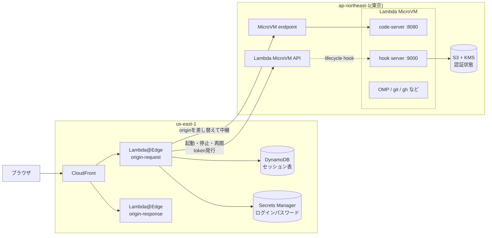
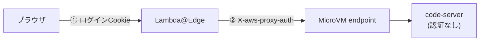
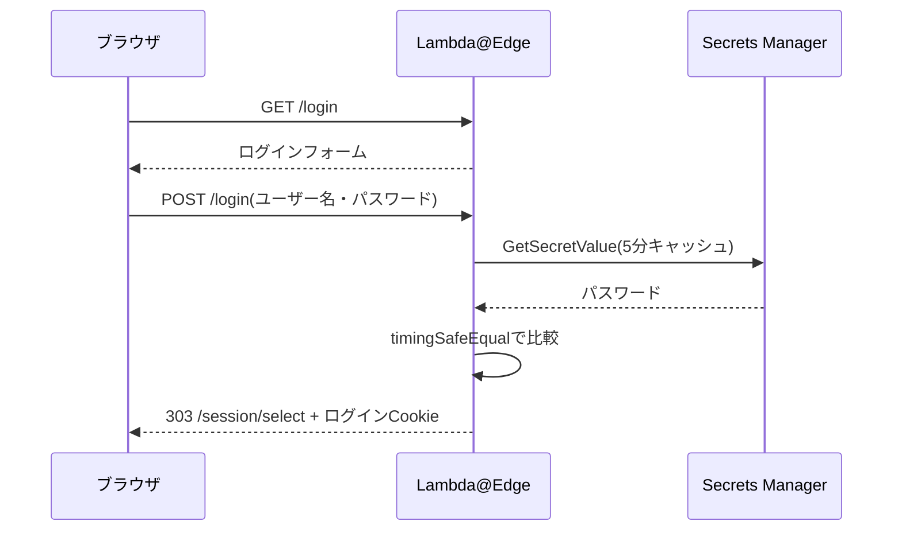
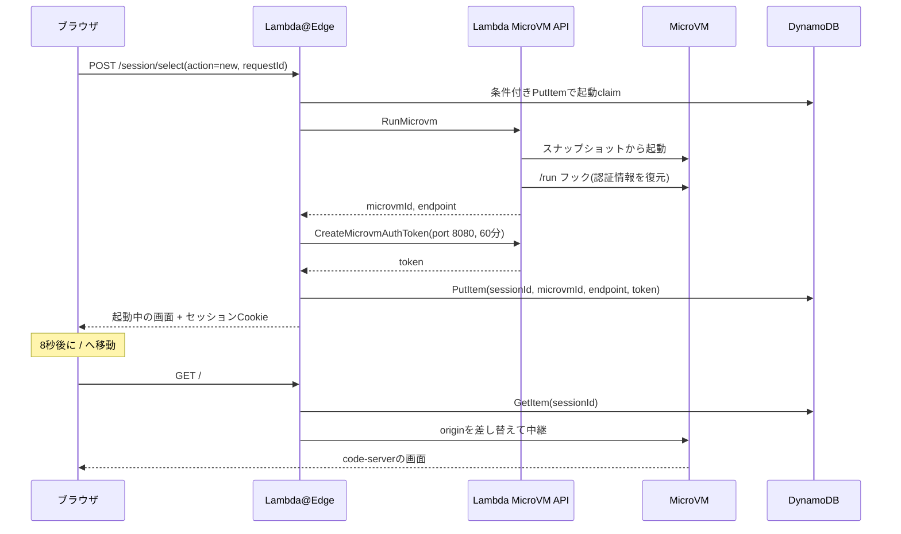

# はじめに
こんにちは、ふくちです。

2026年6月に、AWS Lambda MicroVMsが発表されました。VM単位で分離された実行環境を、サーバーを管理せずに必要なときだけ起動・一時停止・再開できるサービスです。

https://aws.amazon.com/about-aws/whats-new/2026/06/aws-lambda-microvms/

以前、ハンズオン中に気づいたライフサイクルフックのポートの話を書きました。

https://qiita.com/har1101/items/2822a4e3837f0be0729f

今回はこのLambda MicroVMを使って、ブラウザから使える自分専用のCloud IDEを作ってみました。MicroVMの中でcode-server(ブラウザ版のVS Code)とコーディングエージェントのOMP(Oh My Pi)を動かし、どの端末からでも同じ開発環境でAIエージェントと作業できるようにしています。

作ってみると考えることがかなり多かったので、スコープを区切って何本かに分けて書きます。この記事はAWS側の実装の話で、次の4つをまとめます。

- 全体アーキテクチャ
- Lambda MicroVMの設計と実装
- Webアプリの認証とLambda MicroVMの認証、それぞれの仕組みと設計の理由
- ブラウザからLambda MicroVMまでの接続フロー

code-serverの画面表示、中断と再開、OMPとGitHubの認証情報の持ち越しといったアプリ寄りの話は、次の記事で書きます。

# 作ったもの
使う側から見ると、ざっくりこんな流れです。

1. CloudFrontのURLを開くと、ログイン画面が出る
2. ログインすると、セッション選択画面に移る
3. 既存のMicroVMに接続するか、新しいMicroVMを起動するかを選ぶ
4. code-serverが開くので、ターミナルで`omp`を起動して開発する
5. 作業を中断するときは、ステータスバーのボタンからSuspendする

作るにあたって決めた要件はこんな感じです。

- MicroVMは東京リージョンで動かす
- 常時起動のEC2は置かない
- CloudFrontのURLを知っているだけでは、MicroVMを起動できないようにする
- GitHubにはOAuthで接続し、PATを使わない
- MicroVMが終了しても、OMPとGitHubのログイン状態は次のMicroVMへ引き継ぐ
- ブラウザのCookieが消えても、生きているMicroVMへ戻れるようにする

ちなみに個人用なので、利用者は私1人です。この前提がいろいろな設計判断に効いてきます。

# 全体アーキテクチャ
構成図はこんな感じです。



登場するコンポーネントと役割です。

| コンポーネント | 役割 |
| --- | --- |
| CloudFront | ブラウザから見た唯一の入口 |
| Lambda@Edge(origin-request) | ログイン、セッション選択画面、MicroVMの起動・停止・再開、MicroVMへの中継 |
| Lambda@Edge(origin-response) | MicroVMが一時的に502/504を返したときに選択画面へ戻す |
| DynamoDB | ブラウザとMicroVMの対応関係、MicroVM endpoint、MicroVM用のtokenを保存する |
| Secrets Manager | ログインパスワードを保存する |
| Lambda MicroVM | code-serverとOMPを動かす。1セッションにつき1台 |
| S3 + KMS | OMPとGitHub CLIの認証ファイルを暗号化して保存する |

常時起動しているサーバーは1台もありません。computeが必要なときだけMicroVMが動き、それ以外はすべてマネージドサービスで構成しています。

## 2リージョン構成にした理由
CloudFrontに関連付けるLambda@Edgeは、us-east-1で作る必要があります。CloudFront開発者ガイドのLambda@Edgeの制限事項に「The Lambda function must be in the US East (N. Virginia) Region.」と書かれています。

https://docs.aws.amazon.com/AmazonCloudFront/latest/DeveloperGuide/lambda-at-edge-function-restrictions.html

一方で、MicroVMは東京で動かしたいです。先ほどのWhat's Newを見ると、Lambda MicroVMsは発表時点で東京リージョンにも対応しています。

そこでCDKのスタックを、リージョンごとに2つに分けました。

| スタック | リージョン | 中身 |
| --- | --- | --- |
| `OmpCloudIdeMicrovmStack` | ap-northeast-1 | MicroVM Image、S3、KMS、MicroVM用のIAM Role |
| `OmpCloudIdeEdgeStack` | us-east-1 | CloudFront、Lambda@Edge、DynamoDB、Secrets Manager |

DynamoDBとSecrets Managerをus-east-1に置いたのは、Lambda@Edgeがリクエストのたびに読みにいくからです。

2スタック間では、CDKのクロスリージョン参照を使っていません。`lib/config.ts`に固定の名前を書いておき、そこからARNを組み立てて両方のスタックで使い回しています。

```ts:lib/config.ts
export const imageArn =
  `arn:aws:lambda:${config.microvmRegion}:${config.account}:microvm-image:${config.imageName}` as const;
export const executionRoleArn = `arn:aws:iam::${config.account}:role/omp-cloud-ide-microvm-execution` as const;
```

## 状態をどこに持たせるか
設計で一番気を使ったのがここです。このシステムには、寿命も役割も違う状態が6種類あります。

| 状態 | 置き場所 | 寿命 |
| --- | --- | --- |
| ログインしているか | 署名付きCookie | 8時間 |
| どのMicroVMにつなぐか | Cookie(UUIDだけ)とDynamoDB | 8時間 |
| MicroVM endpointに入るためのtoken | DynamoDB | 60分(自動更新) |
| OMPとGitHubのログイン情報 | MicroVMのローカルとS3 | MicroVMをまたいで続く |
| ソースコード | GitHub | ずっと |
| メモリやプロセスなどの実行状態 | MicroVM | 最大8時間 |

これを1つのCookieや1つのテーブルにまとめてしまうと、「ログインは有効なのに接続先だけ消えた」ような中途半端な状態をうまく扱えません。実際に初期実装でこれを踏みました。その話は次の記事で書きます。

# IaCツールと外部モジュール

## AWS CDK + cdkd
IaCはAWS CDK(TypeScript)で書き、デプロイにはcdkdを使いました。

cdkdはgo-to-kさんが開発しているOSSで、CDKアプリをCloudFormationを経由せず、AWS SDKで直接デプロイするCLIです。既存のCDKアプリに対して、`cdk deploy`を`cdkd deploy`に置き換えるだけで使えます。

https://github.com/go-to-k/cdkd

cdkdのREADMEでは、dev/test用途向けと明記されています。今回は個人の開発環境なので、デプロイの速さを優先して採用しました。npm scriptsはこんな感じです。

```json:package.json
"synth": "cdkd synth",
"diff": "cdkd diff --all",
"deploy": "cdkd deploy --all --full-wait",
"deploy:dry-run": "cdkd deploy --all --dry-run",
"destroy": "cdkd destroy --all",
"bootstrap": "cdkd bootstrap --region ap-northeast-1 && cdkd bootstrap --region us-east-1"
```

`--full-wait`を付けると、MicroVM Imageのビルドと、CloudFrontの反映完了まで待ってからコマンドが終わります。これを付けないと、古いLambda@Edgeが残ったまま動作確認を始めてしまうことがありました。

cdkdとLambda@Edgeまわりのハマりどころは、別の記事にまとめています。

## MicroVM ImageはCfnResourceで書く
執筆時点でMicroVM ImageにはCDKのL2コンストラクトがないので、`cdk.CfnResource`で`AWS::Lambda::MicrovmImage`を直接定義しています。

```ts:lib/lambda-microvm-stack.ts
const microvmImage = new cdk.CfnResource(this, 'MicrovmImage', {
  type: 'AWS::Lambda::MicrovmImage',
  properties: {
    Name: config.imageName,
    BaseImageArn: config.baseImageArn, // arn:aws:lambda:ap-northeast-1:aws:microvm-image:al2023-1
    BaseImageVersion: config.baseImageVersion,
    BuildRoleArn: buildRole.roleArn,
    CodeArtifact: { Uri: codeArtifact.s3ObjectUrl }, // Dockerfileなどをzip化したS3 Asset
    CpuConfigurations: [{ Architecture: 'ARM_64' }],
    EgressNetworkConnectors: [egressConnectorArn(config.microvmRegion)],
    EnvironmentVariables: [
      { Key: 'AUTH_STATE_BUCKET', Value: authBucket.bucketName },
      { Key: 'AUTH_STATE_PREFIX', Value: config.authState.prefix },
      // 省略
    ],
    Hooks: {
      Port: 9000,
      MicrovmImageHooks: { Ready: 'ENABLED', ReadyTimeoutInSeconds: 120, Validate: 'ENABLED', ValidateTimeoutInSeconds: 30 },
      MicrovmHooks: {
        Run: 'ENABLED', RunTimeoutInSeconds: 30,
        Resume: 'ENABLED', ResumeTimeoutInSeconds: 10,
        Suspend: 'ENABLED', SuspendTimeoutInSeconds: 45,
        Terminate: 'ENABLED', TerminateTimeoutInSeconds: 45,
      },
    },
    Resources: [{ MinimumMemoryInMiB: 2048 }],
    Logging: { CloudWatch: { LogGroup: imageLogGroup.logGroupName } },
  },
});
```

`CodeArtifact`には、Dockerfileや設定ファイルを置いた`artifact/base-image`ディレクトリをS3 Assetとして渡しています。CDKがzip化してアップロードしてくれるので、自分でzipを作る必要はありません。

## 使っているツール・モジュール一覧
IaCまわりです。

| ツール | version | 用途 |
| --- | --- | --- |
| aws-cdk-lib | 2.270.0 | リソース定義 |
| cdkd(`@go-to-k/cdkd`) | 0.291.0 | synth / diff / deploy / destroy |
| TypeScript | 5.9系 | IaCの型チェック |
| Jest / ts-jest | 30 / 29 | CDKのassertionとLambda@Edgeのテスト |
| Biome | 2.5系 | lint / format |

Lambda@Edgeに同梱しているAWS SDKです。

| モジュール | 用途 |
| --- | --- |
| `@aws-sdk/client-lambda-microvms` | MicroVMのRun / Get / Suspend / Resume、token発行 |
| `@aws-sdk/client-dynamodb` | セッション表の読み書き |
| `@aws-sdk/client-secrets-manager` | ログインパスワードの取得 |

MicroVM Imageに入れている主なツールです。どれもARM64版を使い、versionを固定しています。

| ツール | version |
| --- | --- |
| code-server | 4.126.0 |
| OMP(`@oh-my-pi/pi-coding-agent`) | 18.2.11 |
| Node.js | 24.21.0 |
| Bun | 1.3.14 |
| GitHub CLI | 2.96.0 |
| AWS CLI | 2.34.45 |
| uv | 0.12.18 |
| ripgrep | 15.2.0 |
| Chromium(Sparticuzのarm64 pack) | 149.0.0 |

OMPはcan1357さんが開発しているコーディングエージェントのCLIです。

https://github.com/can1357/oh-my-pi

# Lambda MicroVMの設計と実装

## code-serverが起動した状態をスナップショットにする
Lambda MicroVMのImageは、アプリを起動した後のメモリまで含むスナップショットです。AWSのLambda MicroVM開発者ガイドによると、Image作成時にLambdaは次の流れで処理します。

- S3からzipを取得する
- ベースイメージからMicroVMを起動し、Dockerfileを実行する
- `ENTRYPOINT`か`CMD`でアプリを起動する
- ライフサイクルフックで初期化の完了を待つ
- ディスクとメモリのスナップショットを取る

https://docs.aws.amazon.com/lambda/latest/dg/microvms-images.html

`RunMicrovm`で起動するMicroVMは、このスナップショットから再開します。つまり、アプリを起動した後のメモリの状態からスタートできるわけです。

これを活かすため、`/ready`フックはcode-serverが応答できるようになるまで503を返すようにしました。

```python:lifecycle.py
def code_server_ready() -> bool:
    try:
        with urllib.request.urlopen("http://127.0.0.1:8080/healthz", timeout=2) as response:
            return response.status == 200
    except OSError:
        return False

# HookHandler.do_POST の中
if self.path in {f"{HOOK_PREFIX}/ready", f"{HOOK_PREFIX}/validate"}:
    self.respond(200 if code_server_ready() else 503)
    return
```

Lambdaは503を受け取るとtimeoutまで再試行し、200を受け取った時点でスナップショットを取ります。これでスナップショットには、code-serverが起動し終わった状態が入ります。

## 開発ツールはImageに全部入れる
MicroVMは、RUNNINGとSUSPENDEDを合わせて最大8時間で終了します。毎回起動後にツールを入れていると時間がかかりますし、入るversionも毎回変わり得ます。

そこでcode-server、OMP、Node.js、Bun、Python、GitHub CLI、AWS CLI、LSP、VS Code拡張、ヘッドレスChromiumまで、全部Image作成時に入れておくことにしました。起動後に入れるのは、各リポジトリ固有の依存だけです。

Dockerfileのベースは、AWSが公開している`public.ecr.aws/lambda/microvms:al2023-minimal`です。

```dockerfile:Dockerfile
FROM public.ecr.aws/lambda/microvms:al2023-minimal

ARG CODE_SERVER_VERSION=4.126.0
ARG OMP_VERSION=18.2.11
# 省略

RUN /usr/sbin/groupadd --gid 1000 vscode \
    && /usr/sbin/useradd --uid 1000 --gid 1000 --create-home --home-dir /home/vscode --shell /bin/bash vscode

# 省略

USER vscode
CMD ["/usr/local/bin/start-cloud-ide"]
```

OMPはシェルコマンドを実行できるので、rootでは動かしたくありません。UID 1000の`vscode`ユーザーを作り、ホームディレクトリの所有権を合わせてから`USER vscode`で起動しています。

`CMD`で呼んでいる`start-cloud-ide`は、hook serverとcode-serverを起動するだけのシェルスクリプトです。

```bash:start-cloud-ide.sh
python3 /opt/cloud-ide/lifecycle.py &

exec code-server \
  --bind-addr 0.0.0.0:8080 \
  --auth none \
  --disable-telemetry \
  --user-data-dir /home/vscode/.vscode \
  --extensions-dir /home/vscode/.local/share/code-server/extensions \
  /home/vscode/workspace
```

`--auth none`でcode-serverの認証を切っている理由は、後ほど認証の章で説明します。

ちなみにImageはARM64で作っています。OMPのブラウザ機能で使うARM64向けのChromiumを用意するのに少し工夫が必要だったので、その話は別の記事にしました。

## MicroVMの起動パラメータ
MicroVMの起動はLambda@Edgeが担当します。`RunMicrovm`の呼び出しはこんな感じです。

```js:artifact/edge/index.js
const run = await mvm.send(
  new RunMicrovmCommand({
    imageIdentifier: cfg.IMAGE_ARN,
    executionRoleArn: cfg.EXECUTION_ROLE_ARN,
    ingressNetworkConnectors: [cfg.INGRESS], // ALL_INGRESS
    egressNetworkConnectors: [cfg.EGRESS],   // INTERNET_EGRESS
    idlePolicy: {
      autoResumeEnabled: true,
      maxIdleDurationSeconds: 300,
      suspendedDurationSeconds: 28800,
    },
    maximumDurationInSeconds: 28800,
    // expiresAtはRunMicrovm直前の時刻+8時間。MicroVM内で残り時間を表示するのに使う
    runHookPayload: JSON.stringify({ sessionId: id, expiresAt }),
  }),
);
```

| パラメータ | 値 | 意味 |
| --- | --- | --- |
| `ingressNetworkConnectors` | ALL_INGRESS | MicroVM endpoint経由の受信を許可する |
| `egressNetworkConnectors` | INTERNET_EGRESS | GitHubやLLM providerへの送信を許可する |
| `autoResumeEnabled` | true | Suspend中に通信が届いたら自動で再開する |
| `maxIdleDurationSeconds` | 300 | 5分通信がなければ自動でSuspendする |
| `suspendedDurationSeconds` | 28800 | Suspendが8時間続いたら終了する |
| `maximumDurationInSeconds` | 28800 | 起動から8時間で終了する |

1点注意があって、`maximumDurationInSeconds`はRUNNINGとSUSPENDEDを合わせた総寿命です。AWSのLambda MicroVM開発者ガイドでも「running or suspended state」でいられる最大時間と説明されています。`suspendedDurationSeconds`を8時間にしていても、起動から8時間たった時点でMicroVMは終了します。

https://docs.aws.amazon.com/lambda/latest/dg/microvms-launching.html

なので、ソースコードの保存先はGitHubと割り切り、MicroVMは使い捨ての作業場所として扱っています。

## ライフサイクルフック
ライフサイクルフックは、MicroVMの起動・再開・停止・終了のタイミングで、LambdaがMicroVM内のHTTPサーバーにPOSTしてくれる仕組みです。今回はport 9000で受けて、次の処理をしています。

| フック | 呼ばれるとき | 処理 |
| --- | --- | --- |
| `/ready` | Image作成中 | code-serverが起動していれば200 |
| `/validate` | Image作成後の検証 | 同上 |
| `/run` | MicroVMの起動時 | S3から認証情報を復元する。終了予定時刻を記録する |
| `/resume` | 再開時 | 何もせず200 |
| `/suspend` | Suspendの前 | 認証情報をS3へ保存する |
| `/terminate` | 終了の前 | 認証情報をS3へ保存する |

AWSのLambda MicroVM開発者ガイドには「Your MicroVM begins receiving external traffic after the `/run` hook returns HTTP 200.」とあります。`/run`で認証情報を戻し終わるまでcode-serverに通信が来ないので、ブラウザが開いた時点でOMPやGitHubのログイン状態がそろっています。

一方で、S3の不調でMicroVMの起動やSuspendが止まっては困ります。なので各フックはtimeoutより短い時間(`/run`は25秒、`/suspend`と`/terminate`は40秒)で処理を打ち切り、失敗しても必ず200を返すfail-openにしています。なお、実行中のMicroVMの標準出力はCloudWatch Logsに届かなかったので、保存や復元の結果はMicroVM内の`auth-sync.json`に記録し、code-serverのステータスバーに出しています。この保存と復元の中身は次の記事で詳しく書きます。

## MicroVMに渡す権限は最小限にする
MicroVMの中で使うExecution Roleには、次の権限しか付けていません。

- 認証情報用S3バケットの`personal/*`の読み書き
- そのバケットを暗号化しているKMSキーの利用
- 専用のCloudWatch Logsへの書き込み

OMPはシェルを実行できるので、Execution Roleに付けた権限はそのままOMPも使えます。開発対象のAWS環境を触る権限は、ここには足さない方針にしました。

# 認証の仕組み

## 2層で守る
このシステムの認証は2層あります。



| 層 | 検証する主体 | 検証するもの | ブラウザが持つか |
| --- | --- | --- | --- |
| ① Webアプリの認証 | Lambda@Edge | ログインCookieの署名と期限 | 持つ |
| ② Lambda MicroVMの認証 | AWS(MicroVM endpoint) | proxy tokenの対象MicroVM、port、期限 | 持たない |

## ① Webアプリの認証
ブラウザからCloudFrontのURLを開くと、Lambda@Edgeが自前のログインフォームを返します。



パスワードは、CDKでSecrets Managerに32文字のランダム値を生成させています。ログインに成功すると、Lambda@Edgeが次のようなCookieを発行します。

```js:artifact/edge/index.js
function createAccessCookie(password, now = Date.now()) {
  const expiresAt = Math.floor(now / 1000) + cfg.ACCESS_COOKIE_MAX_AGE_SEC; // 8時間後
  const payload = String(expiresAt);
  const signature = signAccessCookie(payload, password);
  return `${cfg.ACCESS_COOKIE_NAME}=${payload}.${signature}; Path=/; Secure; HttpOnly; SameSite=Strict; Max-Age=${cfg.ACCESS_COOKIE_MAX_AGE_SEC}`;
}

function signAccessCookie(payload, password) {
  return createHmac('sha256', password).update(`omp-cloud-ide:${payload}`).digest('base64url');
}
```

Cookieの値は「有効期限.署名」という形で、署名はパスワードを鍵にしたHMAC-SHA256です。Lambda@Edgeはリクエストのたびに次を確認します。

1. 有効期限が過ぎていないか
2. 有効期限が「今から8時間+60秒」より先になっていないか
3. 署名を計算し直して一致するか

2つ目のチェックは、署名が正しくても寿命が長すぎるCookieを拒否するためのものです。万が一パスワードが漏れて長期間有効なCookieを作られても、受け付けないようにしています。

パスワードそのものはCookieに入りません。パスワードを変えると署名鍵も変わるので、発行済みのCookieは全部無効になります。個人用なので、これを「全端末からのログアウト」代わりにしています。

### なぜこの形にしたのか
最初はHTTPのBasic認証で作っていました。ただ、Chromeでは問題なく動くのに、とある埋め込みブラウザではBasic認証のダイアログが一瞬出て閉じてしまいました。ブラウザの実装に左右されるのがつらかったので、Lambda@EdgeがHTMLのフォームを返す方式に切り替えています。

Cognitoなどを使う案もありましたが、利用者は私1人なので、ユーザー管理やMFAよりもリソースの少なさを優先しました。その代わり、MFAやログイン試行回数の制限はありません。複数人で使うことになったら、Cognito+OIDCへ移行するつもりです。

## ② Lambda MicroVMの認証
Lambda MicroVMは、1台ごとに専用のHTTPS endpointを持ちます。AWSのLambda MicroVM開発者ガイドのNetworkingのページには、次のように書かれています。

> All requests to a MicroVM endpoint require a valid authentication token in the `X-aws-proxy-auth` header.

https://docs.aws.amazon.com/lambda/latest/dg/microvms-networking.html

このtokenは`CreateMicrovmAuthToken`で発行するJWEで、対象のMicroVM、通してよいport、有効期限を持っています。今回はこんな設定にしました。

```js:artifact/edge/index.js
const tokenResponse = await mvm.send(
  new CreateMicrovmAuthTokenCommand({
    microvmIdentifier: run.microvmId,
    expirationInMinutes: 60,
    allowedPorts: [{ port: 8080 }],
  }),
);
const token = tokenResponse.authToken['X-aws-proxy-auth'];
```

| 項目 | 設定 |
| --- | --- |
| 通すport | 8080(code-server)だけ |
| 有効期限 | 60分 |
| 更新 | 残り15分を切ったリクエストで、Lambda@Edgeが新しいtokenを発行する |
| 保存先 | DynamoDB |

ポイントは、このtokenをブラウザに一切渡していないことです。tokenとMicroVM endpointはDynamoDBに置いておき、Lambda@Edgeがリクエストのたびにヘッダーへ付けます。

さらに同じNetworkingのページによると、Lambdaは`X-aws-proxy-*`ヘッダーを取り除いてからアプリへ転送します。つまりcode-serverもtokenを受け取りません。

## code-serverの認証を切っている理由
code-serverは`--auth none`で起動しています。一見こわい設定ですが、次の理由で問題ないと判断しました。

- MicroVM endpointは、有効なtokenがないリクエストを一切通さない
- そのtokenを持っているのはLambda@Edgeだけ
- Lambda@Edgeは、ログインCookieを検証してからでないとtokenを付けない

つまり、ログインを通過しない限りcode-serverには届きません。ここでcode-serverにもパスワードを設定すると、利用者は2回ログインすることになります。

ただし、これは「入口がCloudFrontだけ」という前提の上に成り立っています。将来ほかの経路でcode-serverを公開するときは、必ずcode-server側の認証を戻す必要があります。

## この構成で守れていないもの
正直に書いておくと、守れていないものもあります。

- ログイン画面、セッション選択画面、code-server、code-serverの`/proxy/<port>/`で動かす開発中のアプリは、すべて同じCloudFrontのoriginにあります。`SameSite=Strict`は外部サイトからのCSRFを防ぎますが、同じoriginで動くアプリからのリクエストは防げません。
- cloneしたコード、依存パッケージのinstall script、VS Code拡張、OMPは、全部同じUID 1000で動きます。OMPやGitHubの認証ファイルは、MicroVM内のコードから読めます。

なので現状は、「自分が書くコードと、自分が選んだリポジトリだけを動かす個人環境」という前提で使っています。Edge専用のaccess/session Cookieは認証後にcode-serverへ転送する前に除去しますが、同じoriginのアプリからcontrol画面を操作できる問題や同一UIDの認証ファイルは残ります。根本策はcontrol画面をIDEとは別のホスト名に分けることです。

# Lambda MicroVMへの接続フロー

## 新しいMicroVMを起動するとき
ログイン後、セッション選択画面で「Start a new MicroVM」を押したときの流れです。



ここで1つこだわったのが、ログインしただけではMicroVMを起動しないことです。初期実装では、ログイン後に`/`を開くだけで新しいMicroVMを起動していました。これだとブラウザでページを開き直すだけで課金が始まりますし、動いていたMicroVMにも戻れなくなります。今は`POST /session/select`で明示的に選んだときだけ`RunMicrovm`を呼びます。

同じ起動フォームを二重送信しても、request UUIDのclaimが残っているため2台目は起動しません。token作成やDDB保存に失敗した場合は得られたMicroVM IDをTerminateで補償し、補償まで失敗したVMは選択画面の「Untracked MicroVMs」で検出します。起動直後の一時的な不整合と区別できないので、この一覧から直接終了するボタンは置きません。

## 2回目以降のリクエスト
MicroVMが起動した後は、ブラウザからのリクエストをすべてLambda@Edge(origin-request)が受けて、MicroVMへ中継します。

1. ログインCookieを検証する
2. セッションCookieのUUIDでDynamoDBを読む
3. tokenの残りが15分を切っていたら更新する。失効済みで更新に失敗したら503を返す
4. CloudFrontのoriginをMicroVM endpointに差し替える
5. `Host`、`Origin`、`X-aws-proxy-auth`ヘッダーを付け、Edge専用Cookieだけを除去する

4と5の実装はこんな感じです。

```js:artifact/edge/index.js
const host = result.Item.endpoint.S;
request.origin = {
  custom: {
    domainName: host,
    port: 443,
    protocol: 'https',
    path: '',
    sslProtocols: ['TLSv1.2'],
    readTimeout: 60,
    keepaliveTimeout: 60,
  },
};
request.headers.host = [{ key: 'Host', value: host }];
request.headers['x-aws-proxy-auth'] = [{ key: 'X-aws-proxy-auth', value: token }];
request.headers.origin = [{ key: 'Origin', value: `https://${host}` }];
stripEdgeCookies(request.headers);
return request;
```

Lambda@Edgeからrequestオブジェクトの`origin`を書き換えると、CloudFrontはそのリクエストを書き換え後の宛先へ転送します。originの書き換えはorigin-requestイベントでできるので、このLambda@Edgeはorigin-requestに関連付けています。

CloudFrontの設定の要点です。

| 設定 | 値 | 理由 |
| --- | --- | --- |
| origin | `example.com` | CDKでoriginの指定が必須なので置いているダミー。実際の宛先はLambda@Edgeが差し替える |
| キャッシュ | CachingDisabled | 全部が利用者ごとの動的な応答なので |
| origin request policy | AllViewerExceptHostHeader | CookieやWebSocketのヘッダーをoriginへ渡す。HostはLambda@Edgeが設定する |
| 許可メソッド | ALLOW_ALL | フォームのPOSTやcode-serverのAPIを通す |
| Lambda@Edgeの`includeBody` | true | ログインフォームと選択画面のPOST本文を読むため |

## WebSocketも同じ経路を通る
code-serverは、ブラウザとの間でWebSocketを使います。CloudFront開発者ガイドによると、WebSocketは最初にHTTPのupgradeリクエストを送って接続を確立します。

https://docs.aws.amazon.com/AmazonCloudFront/latest/DeveloperGuide/distribution-working-with.websockets.html

このupgradeリクエストも通常のリクエストと同じくLambda@Edgeを通るので、そこでoriginの差し替えとtokenの付与を済ませています。

`Origin`ヘッダーまで書き換えているのは、code-serverがWebSocket接続時に`Origin`と`Host`のホスト名が一致するかを確認しているからです。code-serverのソースコード(`src/node/http.ts`の`authenticateOrigin`)でこの確認をしています。ブラウザが送ってくる`Origin`はCloudFrontのドメインなので、そのままだとendpointに合わせた`Host`と一致せず、接続を拒否されます。

https://github.com/coder/code-server/blob/main/src/node/http.ts

# まとめ
Lambda MicroVMで自分専用のCloud IDEを作った話のうち、AWS側の実装をまとめました。

- 常駐サーバーを置かず、CloudFront + Lambda@Edgeを制御の中心にした
- Lambda@Edgeはus-east-1、MicroVMは東京に置き、CDKのスタックを2つに分けた
- MicroVM Imageはcode-serverが起動した状態でスナップショットを取り、ツールも全部焼き込んだ
- 認証は「ログインCookie」と「MicroVM endpointのtoken」の2層にし、tokenはブラウザに渡さない
- ブラウザからの通信は、Lambda@Edgeがoriginを差し替えてMicroVMへ中継する

Lambda MicroVMはendpointの認証をAWS側が必ずかけてくれるので、「tokenを誰に持たせるか」を決めれば構成がかなりすっきりしました。個人的にはここが一番面白かったポイントです。

次の記事では、code-serverの画面がどう動いているのか、中断と再開をどう作ったのか、OMPとGitHubの認証情報をどう持ち越しているのかを書きます。

## 参考リンク

https://aws.amazon.com/about-aws/whats-new/2026/06/aws-lambda-microvms/

https://docs.aws.amazon.com/lambda/latest/dg/lambda-microvms-guide.html

https://docs.aws.amazon.com/lambda/latest/dg/microvms-images.html

https://docs.aws.amazon.com/lambda/latest/dg/microvms-launching.html

https://docs.aws.amazon.com/lambda/latest/dg/microvms-networking.html

https://docs.aws.amazon.com/AmazonCloudFront/latest/DeveloperGuide/lambda-at-edge-function-restrictions.html

https://docs.aws.amazon.com/AmazonCloudFront/latest/DeveloperGuide/distribution-working-with.websockets.html

https://github.com/go-to-k/cdkd

https://github.com/coder/code-server

https://github.com/can1357/oh-my-pi
