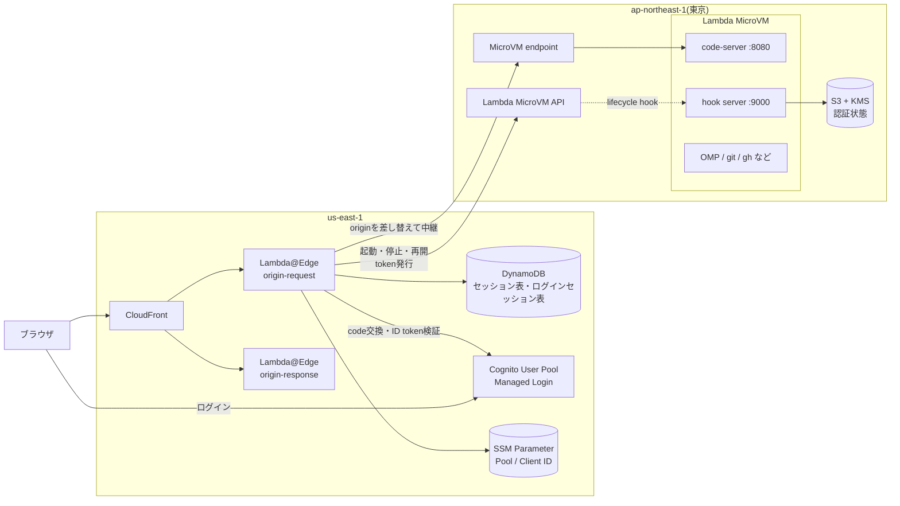
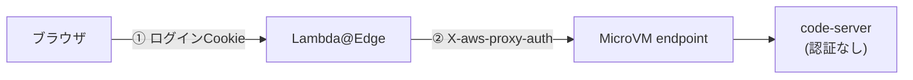
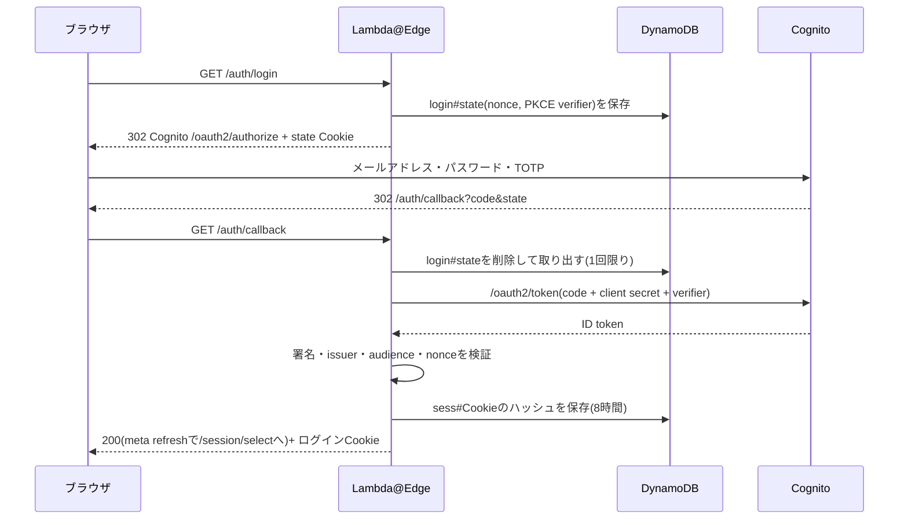
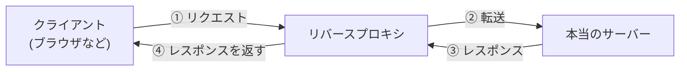
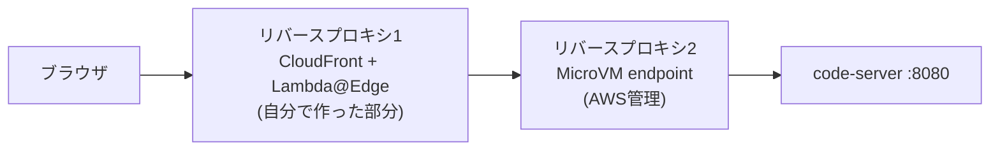
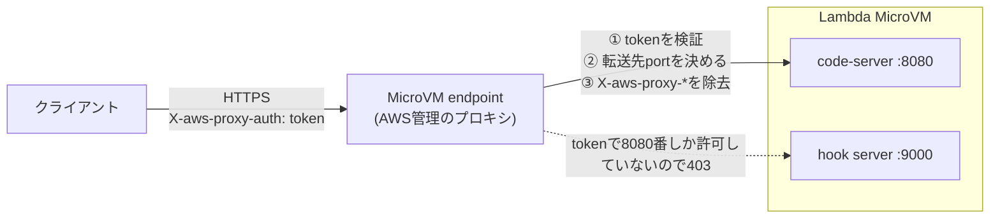
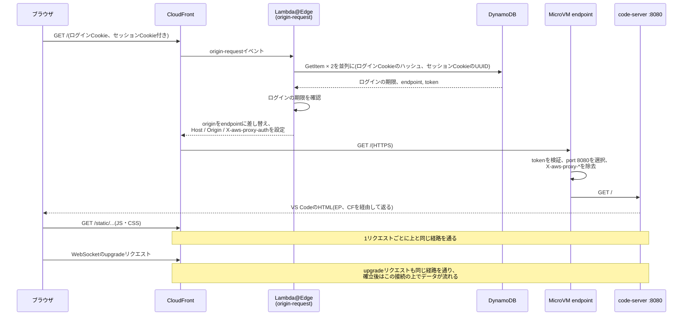
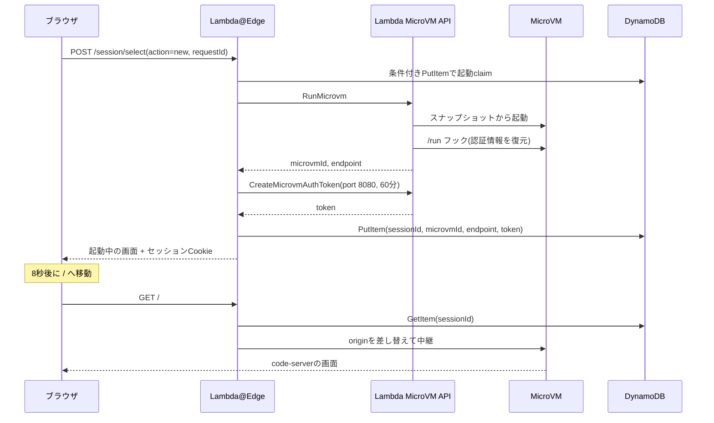

# はじめに
こんにちは、ふくちです。

2026年6月に、AWS Lambda MicroVMsが発表されました。VM単位で分離された実行環境を、サーバーを管理せずに必要なときだけ起動・一時停止・再開できるサービスです。

https://aws.amazon.com/about-aws/whats-new/2026/06/aws-lambda-microvms/

以前、ハンズオン中に気づいたライフサイクルフックのポートの話を書きました。

https://qiita.com/har1101/items/2822a4e3837f0be0729f

今回はこのLambda MicroVMを使って、ブラウザから使える自分専用のCloud IDEを作ってみました。MicroVMの中でcode-server(ブラウザ版のVS Code)とコーディングエージェントのOMP(Oh My Pi)を動かし、どの端末からでも同じ開発環境でAIエージェントと作業できるようにしています。

作ってみると考えることがかなり多かったので、スコープを区切って何本かに分けて書きます。この記事はAWS側の実装の話で、次の4つをまとめます。

- 全体アーキテクチャ
- Lambda MicroVMの設計と実装
- Webアプリの認証とLambda MicroVMの認証、それぞれの仕組みと設計の理由
- ブラウザからLambda MicroVMまでの接続フロー

code-serverの画面表示、中断と再開、OMPとGitHubの認証情報の持ち越しといったアプリ寄りの話は、次の記事で書きます。

# 作ったもの
使う側から見ると、ざっくりこんな流れです。

1. CloudFrontのURLを開くと、Cognitoのログイン画面(Managed Login)が出る
2. メールアドレス・パスワード・TOTPでログインすると、セッション選択画面に移る
3. 既存のMicroVMに接続するか、新しいMicroVMを起動するかを選ぶ
4. code-serverが開くので、ターミナルで`omp`を起動して開発する
5. 作業を中断するときは、ステータスバーのボタンからSuspendする

作るにあたって決めた要件はこんな感じです。

- MicroVMは東京リージョンで動かす
- 常時起動のEC2は置かない
- CloudFrontのURLを知っているだけでは、MicroVMを起動できないようにする
- GitHubにはOAuthで接続し、PATを使わない
- MicroVMが終了しても、OMPとGitHubのログイン状態は次のMicroVMへ引き継ぐ
- ブラウザのCookieが消えても、生きているMicroVMへ戻れるようにする

ちなみに個人用なので、利用者は私1人です。この前提がいろいろな設計判断に効いてきます。

# 全体アーキテクチャ
構成図はこんな感じです。


```mermaid
flowchart LR
    B["ブラウザ"]

    subgraph USE1["us-east-1"]
        CF["CloudFront"]
        ORQ["Lambda@Edge<br/>origin-request"]
        ORS["Lambda@Edge<br/>origin-response"]
        DDB[("DynamoDB<br/>セッション表・ログインセッション表")]
        COG["Cognito User Pool<br/>Managed Login"]
        SSM[("SSM Parameter<br/>Pool / Client ID")]
    end

    subgraph APNE1["ap-northeast-1(東京)"]
        API["Lambda MicroVM API"]
        EP["MicroVM endpoint"]
        subgraph VM["Lambda MicroVM"]
            CS["code-server :8080"]
            HK["hook server :9000"]
            OMP["OMP / git / gh など"]
        end
        S3[("S3 + KMS<br/>認証状態")]
    end

    B --> CF
    CF --> ORQ
    CF --> ORS
    ORQ --> DDB
    ORQ --> SSM
    B -- "ログイン" --> COG
    ORQ -- "code交換・ID token検証" --> COG
    ORQ -- "起動・停止・再開<br/>token発行" --> API
    ORQ -- "originを差し替えて中継" --> EP
    EP --> CS
    API -. "lifecycle hook" .-> HK
    HK --> S3
```

登場するコンポーネントと役割です。

| コンポーネント | 役割 |
| --- | --- |
| CloudFront | ブラウザから見た唯一の入口 |
| Lambda@Edge(origin-request) | Cognitoとのログイン処理、セッション選択画面、MicroVMの起動・停止・再開、MicroVMへの中継 |
| Lambda@Edge(origin-response) | MicroVMが一時的に502/504を返したときに選択画面へ戻す |
| DynamoDB | ブラウザとMicroVMの対応関係、MicroVM endpoint、MicroVM用のtoken、ログイン済みブラウザのセッションを保存する |
| Cognito User Pool | 利用者のパスワードとTOTPを管理し、ログイン画面を提供する |
| SSM Parameter | Lambda@Edgeが実行時に読むUser Pool ID・Client ID |
| Lambda MicroVM | code-serverとOMPを動かす。1セッションにつき1台 |
| S3 + KMS | OMPとGitHub CLIの認証ファイルを暗号化して保存する |

常時起動しているサーバーは1台もありません。computeが必要なときだけMicroVMが動き、それ以外はすべてマネージドサービスで構成しています。

## 2リージョン構成にした理由
CloudFrontに関連付けるLambda@Edgeは、us-east-1で作る必要があります。CloudFront開発者ガイドのLambda@Edgeの制限事項に「The Lambda function must be in the US East (N. Virginia) Region.」と書かれています。

https://docs.aws.amazon.com/AmazonCloudFront/latest/DeveloperGuide/lambda-at-edge-function-restrictions.html

一方で、MicroVMは東京で動かしたいです。先ほどのWhat's Newを見ると、Lambda MicroVMsは発表時点で東京リージョンにも対応しています。

そこでCDKのスタックを、リージョンごとに2つに分けました。

| スタック | リージョン | 中身 |
| --- | --- | --- |
| `OmpCloudIdeMicrovmStack` | ap-northeast-1 | MicroVM Image、S3、KMS、MicroVM用のIAM Role |
| `OmpCloudIdeEdgeStack` | us-east-1 | CloudFront、Lambda@Edge、DynamoDB、Cognito User Pool、SSM Parameter |

DynamoDBとCognitoをus-east-1に置いたのは、Lambda@Edgeがリクエストのたびに(Cognitoはログインのたびに)呼びにいくからです。

2スタック間では、CDKのクロスリージョン参照を使っていません。`lib/config.ts`に固定の名前を書いておき、そこからARNを組み立てて両方のスタックで使い回しています。

```ts:lib/config.ts
export const imageArn =
  `arn:aws:lambda:${config.microvmRegion}:${config.account}:microvm-image:${config.imageName}` as const;
export const executionRoleArn = `arn:aws:iam::${config.account}:role/omp-cloud-ide-microvm-execution` as const;
```

## 状態をどこに持たせるか
設計で一番気を使ったのがここです。このシステムには、寿命も役割も違う状態が6種類あります。

| 状態 | 置き場所 | 寿命 |
| --- | --- | --- |
| ログインしているか | ランダム値のCookieと、そのハッシュを入れたDynamoDB | 8時間 |
| どのMicroVMにつなぐか | Cookie(UUIDだけ)とDynamoDB | 8時間 |
| MicroVM endpointに入るためのtoken | DynamoDB | 60分(自動更新) |
| OMPとGitHubのログイン情報 | MicroVMのローカルとS3 | MicroVMをまたいで続く |
| ソースコード | GitHub | ずっと |
| メモリやプロセスなどの実行状態 | MicroVM | 最大8時間 |

これを1つのCookieや1つのテーブルにまとめてしまうと、「ログインは有効なのに接続先だけ消えた」ような中途半端な状態をうまく扱えません。実際に初期実装でこれを踏みました。その話は次の記事で書きます。

# IaCツールと外部モジュール

## AWS CDK + cdkd
IaCはAWS CDK(TypeScript)で書き、デプロイにはcdkdを使いました。

cdkdはgo-to-kさんが開発しているOSSで、CDKアプリをCloudFormationを経由せず、AWS SDKで直接デプロイするCLIです。既存のCDKアプリに対して、`cdk deploy`を`cdkd deploy`に置き換えるだけで使えます。

https://github.com/go-to-k/cdkd

cdkdのREADMEでは、dev/test用途向けと明記されています。今回は個人の開発環境なので、デプロイの速さを優先して採用しました。npm scriptsはこんな感じです。

```json:package.json
"synth": "cdkd synth",
"diff": "cdkd diff --all",
"deploy": "cdkd deploy --all --full-wait",
"deploy:dry-run": "cdkd deploy --all --dry-run",
"destroy": "cdkd destroy --all",
"bootstrap": "cdkd bootstrap --region ap-northeast-1 && cdkd bootstrap --region us-east-1"
```

`--full-wait`を付けると、MicroVM Imageのビルドと、CloudFrontの反映完了まで待ってからコマンドが終わります。これを付けないと、古いLambda@Edgeが残ったまま動作確認を始めてしまうことがありました。

cdkdとLambda@Edgeまわりのハマりどころは、別の記事にまとめています。

## MicroVM ImageはCfnResourceで書く
執筆時点でMicroVM ImageにはCDKのL2コンストラクトがないので、`cdk.CfnResource`で`AWS::Lambda::MicrovmImage`を直接定義しています。

```ts:lib/lambda-microvm-stack.ts
const microvmImage = new cdk.CfnResource(this, 'MicrovmImage', {
  type: 'AWS::Lambda::MicrovmImage',
  properties: {
    Name: config.imageName,
    BaseImageArn: config.baseImageArn, // arn:aws:lambda:ap-northeast-1:aws:microvm-image:al2023-1
    BaseImageVersion: config.baseImageVersion,
    BuildRoleArn: buildRole.roleArn,
    CodeArtifact: { Uri: codeArtifact.s3ObjectUrl }, // Dockerfileなどをzip化したS3 Asset
    CpuConfigurations: [{ Architecture: 'ARM_64' }],
    EgressNetworkConnectors: [egressConnectorArn(config.microvmRegion)],
    EnvironmentVariables: [
      { Key: 'AUTH_STATE_BUCKET', Value: authBucket.bucketName },
      { Key: 'AUTH_STATE_PREFIX', Value: config.authState.prefix },
      // 省略
    ],
    Hooks: {
      Port: 9000,
      MicrovmImageHooks: { Ready: 'ENABLED', ReadyTimeoutInSeconds: 120, Validate: 'ENABLED', ValidateTimeoutInSeconds: 30 },
      MicrovmHooks: {
        Run: 'ENABLED', RunTimeoutInSeconds: 30,
        Resume: 'ENABLED', ResumeTimeoutInSeconds: 10,
        Suspend: 'ENABLED', SuspendTimeoutInSeconds: 45,
        Terminate: 'ENABLED', TerminateTimeoutInSeconds: 45,
      },
    },
    Resources: [{ MinimumMemoryInMiB: 2048 }],
    Logging: { CloudWatch: { LogGroup: imageLogGroup.logGroupName } },
  },
});
```

`CodeArtifact`には、Dockerfileや設定ファイルを置いた`artifact/base-image`ディレクトリをS3 Assetとして渡しています。CDKがzip化してアップロードしてくれるので、自分でzipを作る必要はありません。

## 使っているツール・モジュール一覧
IaCまわりです。

| ツール | version | 用途 |
| --- | --- | --- |
| aws-cdk-lib | 2.270.0 | リソース定義 |
| cdkd(`@go-to-k/cdkd`) | 0.291.0 | synth / diff / deploy / destroy |
| TypeScript | 5.9系 | IaCの型チェック |
| Jest / ts-jest | 30 / 29 | CDKのassertionとLambda@Edgeのテスト |
| Biome | 2.5系 | lint / format |

Lambda@Edgeに同梱しているAWS SDKです。

| モジュール | 用途 |
| --- | --- |
| `@aws-sdk/client-lambda-microvms` | MicroVMのRun / Get / Suspend / Resume、token発行 |
| `@aws-sdk/client-dynamodb` | セッション表の読み書き |
| `@aws-sdk/client-ssm` | User Pool ID・Client IDの取得 |
| `@aws-sdk/client-cognito-identity-provider` | client secretの取得 |
| `aws-jwt-verify` | CognitoのID tokenの検証 |

MicroVM Imageに入れている主なツールです。どれもARM64版を使い、Dockerfileでversionを固定しています。ただしcode-serverとOMPだけは、`npm run deploy`のたびにその時点の最新版へ自動で書き換えています(後述)。

| ツール | version |
| --- | --- |
| code-server | 4.139.1(deploy時に最新へ更新) |
| OMP(`@oh-my-pi/pi-coding-agent`) | 18.4.0(deploy時に最新へ更新) |
| Node.js | 24.21.0 |
| Bun | 1.3.14 |
| GitHub CLI | 2.96.0 |
| AWS CLI | 2.34.45 |
| uv | 0.12.18 |
| ripgrep | 15.2.0 |
| Chromium(Sparticuzのarm64 pack) | 149.0.0 |

OMPはcan1357さんが開発しているコーディングエージェントのCLIです。

https://github.com/can1357/oh-my-pi

# Lambda MicroVMの設計と実装

## code-serverが起動した状態をスナップショットにする
Lambda MicroVMのImageは、アプリを起動した後のメモリまで含むスナップショットです。AWSのLambda MicroVM開発者ガイドによると、Image作成時にLambdaは次の流れで処理します。

- S3からzipを取得する
- ベースイメージからMicroVMを起動し、Dockerfileを実行する
- `ENTRYPOINT`か`CMD`でアプリを起動する
- ライフサイクルフックで初期化の完了を待つ
- ディスクとメモリのスナップショットを取る

https://docs.aws.amazon.com/lambda/latest/dg/microvms-images.html

`RunMicrovm`で起動するMicroVMは、このスナップショットから再開します。つまり、アプリを起動した後のメモリの状態からスタートできるわけです。

これを活かすため、`/ready`フックはcode-serverが応答できるようになるまで503を返すようにしました。

```python:lifecycle.py
def code_server_ready() -> bool:
    try:
        with urllib.request.urlopen("http://127.0.0.1:8080/healthz", timeout=2) as response:
            return response.status == 200
    except OSError:
        return False

# HookHandler.do_POST の中
if self.path in {f"{HOOK_PREFIX}/ready", f"{HOOK_PREFIX}/validate"}:
    self.respond(200 if code_server_ready() else 503)
    return
```

Lambdaは503を受け取るとtimeoutまで再試行し、200を受け取った時点でスナップショットを取ります。これでスナップショットには、code-serverが起動し終わった状態が入ります。

## 開発ツールはImageに全部入れる
MicroVMは、RUNNINGとSUSPENDEDを合わせて最大8時間で終了します。毎回起動後にツールを入れていると時間がかかりますし、入るversionも毎回変わり得ます。

そこでcode-server、OMP、Node.js、Bun、Python、GitHub CLI、AWS CLI、LSP、VS Code拡張、ヘッドレスChromiumまで、全部Image作成時に入れておくことにしました。起動後に入れるのは、各リポジトリ固有の依存だけです。

Dockerfileのベースは、AWSが公開している`public.ecr.aws/lambda/microvms:al2023-minimal`です。

```dockerfile:Dockerfile
FROM public.ecr.aws/lambda/microvms:al2023-minimal

ARG CODE_SERVER_VERSION=4.139.1
ARG OMP_VERSION=18.4.0
# 省略

RUN /usr/sbin/groupadd --gid 1000 vscode \
    && /usr/sbin/useradd --uid 1000 --gid 1000 --create-home --home-dir /home/vscode --shell /bin/bash vscode

# 省略

USER vscode
CMD ["/usr/local/bin/start-cloud-ide"]
```

OMPはシェルコマンドを実行できるので、rootでは動かしたくありません。UID 1000の`vscode`ユーザーを作り、ホームディレクトリの所有権を合わせてから`USER vscode`で起動しています。

`CMD`で呼んでいる`start-cloud-ide`は、hook serverとcode-serverを起動するだけのシェルスクリプトです。

```bash:start-cloud-ide.sh
python3 /opt/cloud-ide/lifecycle.py &

exec code-server \
  --bind-addr 0.0.0.0:8080 \
  --auth none \
  --disable-telemetry \
  --user-data-dir /home/vscode/.vscode \
  --extensions-dir /home/vscode/.local/share/code-server/extensions \
  /home/vscode/workspace
```

`--auth none`でcode-serverの認証を切っている理由は、後ほど認証の章で説明します。

ちなみにImageはARM64で作っています。OMPのブラウザ機能で使うARM64向けのChromiumを用意するのに少し工夫が必要だったので、その話は別の記事にしました。

## code-serverとOMPはdeployのたびに最新版へ上げる
Imageに焼き込むということは、放っておくとバージョンがずっと古いままになるということです。code-serverとOMPは更新が速いので、ここだけは`npm run deploy`のたびに最新版へ上げるようにしました。

npmには、`deploy`の前に`predeploy`という名前のscriptを自動で実行する仕組みがあります。これを使って、deployの直前に次のことをしています。

1. code-serverはGitHub Releasesの最新版(arm64のRPMがあることも確認)、OMPはnpmの`latest`を調べる
2. Dockerfileの`ARG CODE_SERVER_VERSION=`と`ARG OMP_VERSION=`の行を書き換える
3. そのまま`cdkd deploy`が走る

```json:package.json
"update-versions": "node scripts/update-tool-versions.mjs",
"predeploy": "npm run update-versions",
"deploy": "cdkd deploy --all --full-wait",
```

Dockerfileが変わると、CDKがS3 Assetとして上げるzipのハッシュも変わります。するとMicroVM Imageの`CodeArtifact`が変わったことになり、Imageが作り直されます。逆に新しい版が出ていなければDockerfileはそのままなので、Imageの無駄な作り直しも起きません。

なお、新しいImageが使われるのは次に起動するMicroVMからです。動いているMicroVMのバージョンは変わりません。

## MicroVMの起動パラメータ
MicroVMの起動はLambda@Edgeが担当します。`RunMicrovm`の呼び出しはこんな感じです。

```js:artifact/edge/index.js
const run = await mvm.send(
  new RunMicrovmCommand({
    imageIdentifier: cfg.IMAGE_ARN,
    executionRoleArn: cfg.EXECUTION_ROLE_ARN,
    ingressNetworkConnectors: [cfg.INGRESS], // ALL_INGRESS
    egressNetworkConnectors: [cfg.EGRESS],   // INTERNET_EGRESS
    idlePolicy: {
      autoResumeEnabled: true,
      maxIdleDurationSeconds: 300,
      suspendedDurationSeconds: 28800,
    },
    maximumDurationInSeconds: 28800,
    // expiresAtはRunMicrovm直前の時刻+8時間。MicroVM内で残り時間を表示するのに使う
    runHookPayload: JSON.stringify({ sessionId: id, expiresAt }),
  }),
);
```

| パラメータ | 値 | 意味 |
| --- | --- | --- |
| `ingressNetworkConnectors` | ALL_INGRESS | MicroVM endpoint経由の受信を許可する |
| `egressNetworkConnectors` | INTERNET_EGRESS | GitHubやLLM providerへの送信を許可する |
| `autoResumeEnabled` | true | Suspend中に通信が届いたら自動で再開する |
| `maxIdleDurationSeconds` | 300 | 5分通信がなければ自動でSuspendする |
| `suspendedDurationSeconds` | 28800 | Suspendが8時間続いたら終了する |
| `maximumDurationInSeconds` | 28800 | 起動から8時間で終了する |

1点注意があって、`maximumDurationInSeconds`はRUNNINGとSUSPENDEDを合わせた総寿命です。AWSのLambda MicroVM開発者ガイドでも「running or suspended state」でいられる最大時間と説明されています。`suspendedDurationSeconds`を8時間にしていても、起動から8時間たった時点でMicroVMは終了します。

https://docs.aws.amazon.com/lambda/latest/dg/microvms-launching.html

なので、ソースコードの保存先はGitHubと割り切り、MicroVMは使い捨ての作業場所として扱っています。

## ライフサイクルフック
ライフサイクルフックは、MicroVMの起動・再開・停止・終了のタイミングで、LambdaがMicroVM内のHTTPサーバーにPOSTしてくれる仕組みです。今回はport 9000で受けて、次の処理をしています。

| フック | 呼ばれるとき | 処理 |
| --- | --- | --- |
| `/ready` | Image作成中 | code-serverが起動していれば200 |
| `/validate` | Image作成後の検証 | 同上 |
| `/run` | MicroVMの起動時 | S3から認証情報を復元する。終了予定時刻を記録する |
| `/resume` | 再開時 | 何もせず200 |
| `/suspend` | Suspendの前 | 認証情報をS3へ保存する |
| `/terminate` | 終了の前 | 認証情報をS3へ保存する |

AWSのLambda MicroVM開発者ガイドには「Your MicroVM begins receiving external traffic after the `/run` hook returns HTTP 200.」とあります。`/run`で認証情報を戻し終わるまでcode-serverに通信が来ないので、ブラウザが開いた時点でOMPやGitHubのログイン状態がそろっています。

一方で、S3の不調でMicroVMの起動やSuspendが止まっては困ります。なので各フックはtimeoutより短い時間(`/run`は25秒、`/suspend`と`/terminate`は40秒)で処理を打ち切り、失敗しても必ず200を返すfail-openにしています。なお、実行中のMicroVMの標準出力はCloudWatch Logsに届かなかったので、保存や復元の結果はMicroVM内の`auth-sync.json`に記録し、code-serverのステータスバーに出しています。この保存と復元の中身は次の記事で詳しく書きます。

## MicroVMに渡す権限は最小限にする
MicroVMの中で使うExecution Roleには、次の権限しか付けていません。

- 認証情報用S3バケットの`personal/*`の読み書き
- そのバケットを暗号化しているKMSキーの利用
- 専用のCloudWatch Logsへの書き込み

OMPはシェルを実行できるので、Execution Roleに付けた権限はそのままOMPも使えます。開発対象のAWS環境を触る権限は、ここには足さない方針にしました。

# 認証の仕組み

## 2層で守る
このシステムの認証は2層あります。


```mermaid
flowchart LR
    B["ブラウザ"] -- "① ログインCookie" --> E["Lambda@Edge"]
    E -- "② X-aws-proxy-auth" --> EP["MicroVM endpoint"]
    EP --> CS["code-server<br/>(認証なし)"]
```

| 層 | 検証する主体 | 検証するもの | ブラウザが持つか |
| --- | --- | --- | --- |
| ① Webアプリの認証 | Lambda@Edge | ログインCookieに対応するDynamoDBの行と期限 | 持つ |
| ② Lambda MicroVMの認証 | AWS(MicroVM endpoint) | proxy tokenの対象MicroVM、port、期限 | 持たない |

## ① Webアプリの認証
ログインにはAmazon Cognitoを使っています。利用者は私1人なので、User Poolは管理者だけがユーザーを作れる設定にし、セルフサインアップはできません。MFAはTOTP必須です。ログイン画面はCognitoのManaged Loginをそのまま使っています。

ポイントは、CognitoのtokenをブラウザにもCookieにも入れていないことです。Lambda@EdgeがBFF(Backend for Frontend)として認可コードを受け取り、ID tokenを1回だけ検証したら捨てます。ブラウザに渡すのは、ランダムな値のCookieだけです。


```mermaid
sequenceDiagram
    participant B as ブラウザ
    participant E as Lambda@Edge
    participant D as DynamoDB
    participant C as Cognito
    B->>E: GET /auth/login
    E->>D: login#35;state(nonce, PKCE verifier)を保存
    E-->>B: 302 Cognito /oauth2/authorize + state Cookie
    B->>C: メールアドレス・パスワード・TOTP
    C-->>B: 302 /auth/callback?code&state
    B->>E: GET /auth/callback
    E->>D: login#35;stateを削除して取り出す(1回限り)
    E->>C: /oauth2/token(code + client secret + verifier)
    C-->>E: ID token
    E->>E: 署名・issuer・audience・nonceを検証
    E->>D: sess#35;Cookieのハッシュを保存(8時間)
    E-->>B: 200(meta refreshで/session/selectへ)+ ログインCookie
```

ログインが終わると、Lambda@Edgeは次のようなCookieを発行し、DynamoDBにはそのSHA-256だけを保存します。

```js:artifact/edge/index.js
function authSessionKey(accessCookie) {
  return `sess#${createHash('sha256').update(accessCookie).digest('base64url')}`;
}

function createAccessCookie(value) {
  return `${cfg.ACCESS_COOKIE_NAME}=${value}; Path=/; Secure; HttpOnly; SameSite=Strict; Max-Age=${cfg.ACCESS_COOKIE_MAX_AGE_SEC}`;
}
```

Cookieの値は32バイトの乱数です。Lambda@Edgeはリクエストのたびに、このハッシュでDynamoDBの行を引き、期限が切れていないかを確認します。DynamoDBのTTLはすぐには消してくれないので、期限はコードの側でも見ています。ログアウトは行を消すだけなので、サーバー側ですぐに失効させられます。

認証用の行と、どのMicroVMにつなぐかの行は、2つの`GetItem`を並列に投げて読んでいます。もともとリクエストのたびにMicroVMの行を読んでいたので、認証が増えてもDynamoDBの往復は1回のままです。

### 注意点: callbackで302を返すとログインがループする
callbackの最後で`/session/select`へ302を返すと、そのリダイレクトはCognitoのドメインから始まったクロスサイトのナビゲーションの続きになります。ブラウザはこの流れの中では`SameSite=Strict`のCookieを送らないので、発行したばかりのログインCookieが届かず、またログイン画面へ戻されてしまいます。

そこでcallbackは200のHTMLを返し、`<meta http-equiv="refresh">`で`/session/select`へ移るようにしました。こうすると同じサイトから始まる新しいナビゲーションになり、Cookieが送られます。

逆に、`/auth/login`で発行するstate用のCookieは、Cognitoから戻ってくるときに届かないといけないので`SameSite=Lax`にし、`Path=/auth/callback`に絞っています。

### Lambda@Edgeに設定を渡す
Lambda@Edgeでは環境変数が使えません。さらに、User Pool IDやClient IDはデプロイ時に決まるので、そのまま`config.json`へ書くとアセットのハッシュが安定しません。そこで、IDは固定名のSSM Parameter(`/omp-cloud-ide/cognito`)に置き、Lambda@Edgeが実行時に読んでいます。

client secretは、CloudFormationの`Fn::GetAtt`では取り出せません(`ClientSecret`の戻り値はサポートされていません)。なのでLambda@Edgeが`DescribeUserPoolClient`でCognitoから直接取得し、5分キャッシュしています。secretがImageやパラメータに残りません。

### なぜこの形にしたのか
最初はHTTPのBasic認証で作っていました。ただ、Chromeでは問題なく動くのに、とある埋め込みブラウザではBasic認証のダイアログが一瞬出て閉じてしまいました。そこでLambda@EdgeがHTMLのフォームを返し、Secrets Managerのパスワードで照合してHMAC署名付きCookieを発行する方式に切り替えました。

ただ、この方式にはMFAもログイン試行回数の制限もなく、ログアウトもパスワードを変える以外に方法がありませんでした。Cognitoに移すと、パスワードの保管、TOTP、ロックアウト(5回失敗すると待ち時間が指数的に伸び、最大15分ほど)をCognito側に任せられます。料金面でも、Essentialsプランは月10,000 MAUまで無料枠に収まります。

なお、User Poolに入っているユーザーは全員が全MicroVMにアクセスできます。セッションを利用者ごとに分けたり、S3の認証状態を利用者ごとに分けたりはしていません。2人目を追加するなら、先にそこを作る必要があります。

## ② Lambda MicroVMの認証
Lambda MicroVMは、1台ごとに専用のHTTPS endpointを持ちます。AWSのLambda MicroVM開発者ガイドのNetworkingのページには、次のように書かれています。

> All requests to a MicroVM endpoint require a valid authentication token in the `X-aws-proxy-auth` header.

https://docs.aws.amazon.com/lambda/latest/dg/microvms-networking.html

このtokenは`CreateMicrovmAuthToken`で発行するJWEで、対象のMicroVM、通してよいport、有効期限を持っています。今回はこんな設定にしました。

```js:artifact/edge/index.js
const tokenResponse = await mvm.send(
  new CreateMicrovmAuthTokenCommand({
    microvmIdentifier: run.microvmId,
    expirationInMinutes: 60,
    allowedPorts: [{ port: 8080 }],
  }),
);
const token = tokenResponse.authToken['X-aws-proxy-auth'];
```

| 項目 | 設定 |
| --- | --- |
| 通すport | 8080(code-server)だけ |
| 有効期限 | 60分 |
| 更新 | 残り15分を切ったリクエストで、Lambda@Edgeが新しいtokenを発行する |
| 保存先 | DynamoDB |

ポイントは、このtokenをブラウザに一切渡していないことです。tokenとMicroVM endpointはDynamoDBに置いておき、Lambda@Edgeがリクエストのたびにヘッダーへ付けます。

さらに同じNetworkingのページによると、Lambdaは`X-aws-proxy-*`ヘッダーを取り除いてからアプリへ転送します。つまりcode-serverもtokenを受け取りません。

## code-serverの認証を切っている理由
code-serverは`--auth none`で起動しています。一見こわい設定ですが、次の理由で問題ないと判断しました。

- MicroVM endpointは、有効なtokenがないリクエストを一切通さない
- そのtokenを持っているのはLambda@Edgeだけ
- Lambda@Edgeは、ログインCookieを検証してからでないとtokenを付けない

つまり、ログインを通過しない限りcode-serverには届きません。ここでcode-serverにもパスワードを設定すると、利用者は2回ログインすることになります。

ただし、これは「入口がCloudFrontだけ」という前提の上に成り立っています。将来ほかの経路でcode-serverを公開するときは、必ずcode-server側の認証を戻す必要があります。

## この構成で守れていないもの
正直に書いておくと、守れていないものもあります。

- セッション選択画面、制御画面、code-server、code-serverの`/proxy/<port>/`で動かす開発中のアプリは、すべて同じCloudFrontのoriginにあります(ログイン画面だけはCognitoのドメインです)。`SameSite=Strict`は外部サイトからのCSRFを防ぎますが、同じoriginで動くアプリからのリクエストは防げません。
- cloneしたコード、依存パッケージのinstall script、VS Code拡張、OMPは、全部同じUID 1000で動きます。OMPやGitHubの認証ファイルは、MicroVM内のコードから読めます。

なので現状は、「自分が書くコードと、自分が選んだリポジトリだけを動かす個人環境」という前提で使っています。Edge専用のaccess/session Cookieは認証後にcode-serverへ転送する前に除去しますが、同じoriginのアプリからcontrol画面を操作できる問題や同一UIDの認証ファイルは残ります。根本策はcontrol画面をIDEとは別のホスト名に分けることです。

# Lambda MicroVMへの接続フロー

## そもそもLambda MicroVMにはどうやって接続するのか
具体的なフローに入る前に、Lambda MicroVMへの接続方法そのものを整理しておきます。

EC2のようにIPアドレスへSSHしたり、任意のportへ直接つないだりするものではありません。外からMicroVMへ入る経路は、AWSがMicroVMごとに払い出すHTTPSのURL(MicroVM endpoint)の1つだけです。AWSのLambda MicroVM開発者ガイドには、次のように書かれています。

> Every MicroVM gets a unique public HTTPS endpoint URL, assigned when you call `run-microvm`. You connect to your application running inside the MicroVM through this URL.

https://docs.aws.amazon.com/lambda/latest/dg/microvms-launching.html

endpointは`RunMicrovm`のレスポンスの`endpoint`で返ってくるホスト名で、ドキュメントの例では`abc123def456.lambda-microvm.us-east-1.on.aws`のような形をしています。1つのendpointは1台のMicroVMだけに対応し、複数台に振り分けることはありません。なお、MicroVM endpointで外から受け付けるには、`RunMicrovm`でingressのネットワークコネクター(今回は`ALL_INGRESS`)を指定しておく必要があります。

### リバースプロキシとは
この先の説明には「リバースプロキシ」という言葉が何度も出てくるので、先に説明しておきます。

プロキシ(proxy)は「代理」という意味で、通信の間に入って代わりにリクエストを送る中継役のサーバーのことです。そのうちリバースプロキシは、**サーバーの手前に立って、サーバーの代わりにリクエストを受け付ける中継役**です。


```mermaid
flowchart LR
    C["クライアント<br/>(ブラウザなど)"] -- "① リクエスト" --> RP["リバースプロキシ"]
    RP -- "② 転送" --> S["本当のサーバー"]
    S -- "③ レスポンス" --> RP
    RP -- "④ レスポンスを返す" --> C
```

会社の代表電話にたとえると分かりやすいです。お客さんは代表番号(リバースプロキシ)に電話するだけで、担当者の内線番号(本当のサーバー)は知りません。受付が用件を聞き、相手を確認したうえで担当者へ回してくれます。お客さんから見ると、ずっと代表番号と話しているように見えます。

リバースプロキシは中継するついでに、いろいろな仕事をこなせます。

| 仕事 | 内容 |
| --- | --- |
| 転送先を決める | リクエストの中身を見て、どのサーバーへ回すかを決める |
| 認証 | 許可されていないリクエストを、サーバーへ届く前に断る |
| ヘッダーの書き換え | 転送するときに、ヘッダーを足したり消したりする |
| HTTPSの処理 | クライアントとのHTTPS通信を引き受ける |

nginxやALB、CloudFrontも、よくリバースプロキシとして使われています。ちなみに、社内ネットワークから外のWebサイトへ出ていくときに通る「プロキシ」は、クライアント側の代理をするものでフォワードプロキシと呼ばれます。代理する向きが逆なので「リバース」です。

このシステムでは、ブラウザとcode-serverの間にリバースプロキシが**2段**入っています。


```mermaid
flowchart LR
    B["ブラウザ"] --> RP1["リバースプロキシ1<br/>CloudFront + Lambda@Edge<br/>(自分で作った部分)"]
    RP1 --> RP2["リバースプロキシ2<br/>MicroVM endpoint<br/>(AWS管理)"]
    RP2 --> CS["code-server :8080"]
```

| | 転送先を決める | 認証 | ヘッダーの書き換え |
| --- | --- | --- | --- |
| リバースプロキシ1(CloudFront + Lambda@Edge) | セッションCookieからDynamoDBを引き、そのMicroVMのendpointへ | ログインCookieを検証する | `X-aws-proxy-auth`、`Host`、`Origin`を付け、Edge専用Cookieを消す |
| リバースプロキシ2(MicroVM endpoint) | port 8080へ | tokenを検証する | `X-aws-proxy-*`を消す |

ブラウザから見るとCloudFrontが、code-serverから見るとMicroVM endpointが、それぞれ話し相手に見えています。どちらも間に中継役がいることを意識しなくて済むのが、リバースプロキシのいいところです。

### MicroVM endpointがやっていること
MicroVM endpointの正体は、AWSが管理しているリバースプロキシです。届いたリクエストに対して、次の処理をしてからMicroVMの中のportへ転送します。


```mermaid
flowchart LR
    C["クライアント"] -- "HTTPS<br/>X-aws-proxy-auth: token" --> EP["MicroVM endpoint<br/>(AWS管理のプロキシ)"]
    subgraph VM["Lambda MicroVM"]
        CS["code-server :8080"]
        HK["hook server :9000"]
    end
    EP -- "① tokenを検証<br/>② 転送先portを決める<br/>③ X-aws-proxy-*を除去" --> CS
    EP -. "tokenで8080番しか許可していないので403" .-> HK
```

1. `X-aws-proxy-auth`ヘッダーのtokenを検証する。tokenがない、期限切れ、別のMicroVM用なら403を返す
2. 転送先のportを決める。`X-aws-proxy-port`ヘッダー、WebSocketのサブプロトコル(`lambda-microvms.port.N`)の順に見て、どちらもなければ8080番
3. そのportがtokenの`allowedPorts`に入っていなければ403を返す
4. `X-aws-proxy-*`ヘッダーを取り除いて、MicroVMの中のportへ転送する

https://docs.aws.amazon.com/lambda/latest/dg/microvms-networking.html

つまり、MicroVMのアプリにつなぐのに必要なのは次の3つだけです。

| 必要なもの | 手に入れ方 | このプロジェクトでの値 |
| --- | --- | --- |
| 宛先のホスト名 | `RunMicrovm`のレスポンスの`endpoint` | DynamoDBに保存 |
| token | `CreateMicrovmAuthToken`のレスポンスの`X-aws-proxy-auth` | port 8080だけ、60分。DynamoDBに保存 |
| 転送先のport | `X-aws-proxy-port`ヘッダー、または省略して8080 | 省略(code-serverが8080で待っているので、デフォルトのままでよい) |

手元から試すなら、curlでこう叩くだけです。

```bash
curl "https://${ENDPOINT}/" -H "X-aws-proxy-auth: ${TOKEN}"
```

`X-aws-proxy-port`を省略しているので8080番、つまりcode-serverへ届き、code-serverのHTMLが返ってきます。逆に`X-aws-proxy-port: 9000`を付けてhook serverを狙っても、tokenが8080番しか許可していないので403で弾かれます。

### なぜブラウザからendpointへ直接つながないのか
ここまでの話だけなら、ブラウザでMicroVM endpointのURLを開けばよさそうに見えます。ところが、ブラウザでは素直にいきません。

- アドレスバーにURLを打ったり、リンクをクリックしたりしたときの通信には、`X-aws-proxy-auth`のような任意のヘッダーを付けられない
- JavaScriptの`WebSocket`も任意のヘッダーを付けられない。AWSはこのためにtokenをサブプロトコルで渡す方法を用意しているが、そうするとtokenをブラウザのJavaScriptに渡すことになる
- そもそもcode-serverは自分で作ったアプリではないので、「すべての通信にtokenを付ける」ように改造できない

そこで、ブラウザとMicroVM endpointの間に「tokenを付けて中継する係」を置くことにしました。それがCloudFront + Lambda@Edgeです。ブラウザはいつもの感覚でCloudFrontのURLを開くだけで、tokenの付与はすべてLambda@Edgeが代わりにやります。

## ブラウザにcode-serverの画面が表示されるまで
セッションを選び終わった状態で、ブラウザがCloudFrontのURL(`https://xxxx.cloudfront.net/`)を開いたときに起きていることを順番に追います。


```mermaid
sequenceDiagram
    participant B as ブラウザ
    participant CF as CloudFront
    participant E as Lambda@Edge<br/>(origin-request)
    participant D as DynamoDB
    participant EP as MicroVM endpoint
    participant CS as code-server :8080
    B->>CF: GET /(ログインCookie、セッションCookie付き)
    CF->>E: origin-requestイベント
    E->>D: GetItem × 2を並列に(ログインCookieのハッシュ、セッションCookieのUUID)
    D-->>E: ログインの期限、endpoint, token
    E->>E: ログインの期限を確認
    E-->>CF: originをendpointに差し替え、<br/>Host / Origin / X-aws-proxy-authを設定
    CF->>EP: GET /(HTTPS)
    EP->>EP: tokenを検証、port 8080を選択、<br/>X-aws-proxy-*を除去
    EP->>CS: GET /
    CS-->>B: VS CodeのHTML(EP、CFを経由して返る)
    B->>CF: GET /static/...(JS・CSS)
    Note over CF,CS: 1リクエストごとに上と同じ経路を通る
    B->>CF: WebSocketのupgradeリクエスト
    Note over CF,CS: upgradeリクエストも同じ経路を通り、<br/>確立後はこの接続の上でデータが流れる
```

1. ブラウザがCloudFrontへ`GET /`を送る。ブラウザが知っているのはCloudFrontのドメインとCookieだけ
2. CloudFrontのキャッシュは無効にしているので、すべてのリクエストでorigin-requestのLambda@Edgeが呼ばれる
3. Lambda@Edgeが、ログインCookieのハッシュとセッションCookieのUUIDでDynamoDBを並列に読み、ログインの期限を確かめてからendpointとtokenを使う
4. Lambda@Edgeがリクエストのoriginをendpointへ差し替え、`Host`、`Origin`、`X-aws-proxy-auth`を付けてCloudFrontに返す。URLのパスはそのまま
5. CloudFrontが、差し替え後のendpointへHTTPSで転送する
6. MicroVM endpointがtokenを検証し、`X-aws-proxy-port`がないので8080番のcode-serverへ転送する
7. code-serverがVS CodeのHTMLを返す。レスポンスは来た道を戻り、ブラウザにはCloudFrontから返ってきたように見える
8. ブラウザがHTMLを読み、JSやCSSを取りにいく。これも1リクエストずつ同じ経路を通る
9. VS CodeのJSがブラウザで動き出し、`wss://xxxx.cloudfront.net/...`へWebSocketをつなぐ。最初のupgradeリクエストも同じ経路を通り、接続が確立した後はその上でターミナルやファイル操作のデータが流れ続ける

ポイントは、ブラウザとcode-serverが、お互いに相手の本当の場所を知らないことです。

| 立場 | 見えているもの | 見えていないもの |
| --- | --- | --- |
| ブラウザ | CloudFrontのドメイン、ログインCookie、セッションCookie(UUIDだけ) | MicroVM endpoint、token、MicroVM ID |
| Lambda@Edge | すべて(DynamoDB経由) | なし |
| code-server | endpointのホスト名(`Host`と`Origin`)、code-server自身のCookie | CloudFrontのドメイン、token、Edge専用Cookie |

code-serverから見ると、自分のendpointへ直接アクセスされているのと同じに見えます。ブラウザから見ると、CloudFrontの上でVS Codeが動いているように見えます。この2つの見え方のズレを埋めているのがLambda@Edgeによる書き換えで、後で出てくる`Origin`ヘッダーの書き換えもその一部です。

なお、画面を描いているのはMicroVMではなくブラウザです。code-serverはVS CodeのUIをHTMLとJSとして配り、ブラウザ上で動くUIがWebSocketでMicroVM側のファイルやターミナルを操作しています。この仕組みは次の記事で詳しく書きます。

## 新しいMicroVMを起動するとき
ログイン後、セッション選択画面で「Start a new MicroVM」を押したときの流れです。


```mermaid
sequenceDiagram
    participant B as ブラウザ
    participant E as Lambda@Edge
    participant API as Lambda MicroVM API
    participant VM as MicroVM
    participant D as DynamoDB
    B->>E: POST /session/select(action=new, requestId)
    E->>D: 条件付きPutItemで起動claim
    E->>API: RunMicrovm
    API->>VM: スナップショットから起動
    API->>VM: /run フック(認証情報を復元)
    API-->>E: microvmId, endpoint
    E->>API: CreateMicrovmAuthToken(port 8080, 60分)
    API-->>E: token
    E->>D: PutItem(sessionId, microvmId, endpoint, token)
    E-->>B: 起動中の画面 + セッションCookie
    Note over B: 8秒後に / へ移動
    B->>E: GET /
    E->>D: GetItem(sessionId)
    E->>VM: originを差し替えて中継
    VM-->>B: code-serverの画面
```

ここで1つこだわったのが、ログインしただけではMicroVMを起動しないことです。初期実装では、ログイン後に`/`を開くだけで新しいMicroVMを起動していました。これだとブラウザでページを開き直すだけで課金が始まりますし、動いていたMicroVMにも戻れなくなります。今は`POST /session/select`で明示的に選んだときだけ`RunMicrovm`を呼びます。

同じ起動フォームを二重送信しても、request UUIDのclaimが残っているため2台目は起動しません。token作成やDDB保存に失敗した場合は得られたMicroVM IDをTerminateで補償し、補償まで失敗したVMは選択画面の「Untracked MicroVMs」で検出します。起動直後の一時的な不整合と区別できないので、この一覧から直接終了するボタンは置きません。

## 2回目以降のリクエスト
MicroVMが起動した後は、ブラウザからのリクエストをすべてLambda@Edge(origin-request)が受けて、MicroVMへ中継します。

1. ログインCookieのハッシュでDynamoDBの行を読み、期限を確かめる(次の読み取りと並列)
2. セッションCookieのUUIDでDynamoDBを読む
3. tokenの残りが15分を切っていたら更新する。失効済みで更新に失敗したら503を返す
4. CloudFrontのoriginをMicroVM endpointに差し替える
5. `Host`、`Origin`、`X-aws-proxy-auth`ヘッダーを付け、Edge専用Cookieだけを除去する

4と5の実装はこんな感じです。

```js:artifact/edge/index.js
const host = result.Item.endpoint.S;
request.origin = {
  custom: {
    domainName: host,
    port: 443,
    protocol: 'https',
    path: '',
    sslProtocols: ['TLSv1.2'],
    readTimeout: 60,
    keepaliveTimeout: 60,
  },
};
request.headers.host = [{ key: 'Host', value: host }];
request.headers['x-aws-proxy-auth'] = [{ key: 'X-aws-proxy-auth', value: token }];
request.headers.origin = [{ key: 'Origin', value: `https://${host}` }];
stripEdgeCookies(request.headers);
return request;
```

Lambda@Edgeからrequestオブジェクトの`origin`を書き換えると、CloudFrontはそのリクエストを書き換え後の宛先へ転送します。originの書き換えはorigin-requestイベントでできるので、このLambda@Edgeはorigin-requestに関連付けています。

CloudFrontの設定の要点です。

| 設定 | 値 | 理由 |
| --- | --- | --- |
| origin | `example.com` | CDKでoriginの指定が必須なので置いているダミー。実際の宛先はLambda@Edgeが差し替える |
| キャッシュ | CachingDisabled | 全部が利用者ごとの動的な応答なので |
| origin request policy | AllViewerExceptHostHeader | CookieやWebSocketのヘッダーをoriginへ渡す。HostはLambda@Edgeが設定する |
| 許可メソッド | ALLOW_ALL | フォームのPOSTやcode-serverのAPIを通す |
| Lambda@Edgeの`includeBody` | true | 選択画面や制御画面のフォームのPOST本文を読むため |

## WebSocketも同じ経路を通る
code-serverは、ブラウザとの間でWebSocketを使います。CloudFront開発者ガイドによると、WebSocketは最初にHTTPのupgradeリクエストを送って接続を確立します。

https://docs.aws.amazon.com/AmazonCloudFront/latest/DeveloperGuide/distribution-working-with.websockets.html

このupgradeリクエストも通常のリクエストと同じくLambda@Edgeを通るので、そこでoriginの差し替えとtokenの付与を済ませています。

`Origin`ヘッダーまで書き換えているのは、code-serverがWebSocket接続時に`Origin`と`Host`のホスト名が一致するかを確認しているからです。code-serverのソースコード(`src/node/http.ts`の`authenticateOrigin`)でこの確認をしています。ブラウザが送ってくる`Origin`はCloudFrontのドメインなので、そのままだとendpointに合わせた`Host`と一致せず、接続を拒否されます。

https://github.com/coder/code-server/blob/main/src/node/http.ts

# まとめ
Lambda MicroVMで自分専用のCloud IDEを作った話のうち、AWS側の実装をまとめました。

- 常駐サーバーを置かず、CloudFront + Lambda@Edgeを制御の中心にした
- Lambda@Edgeはus-east-1、MicroVMは東京に置き、CDKのスタックを2つに分けた
- MicroVM Imageはcode-serverが起動した状態でスナップショットを取り、ツールも全部焼き込んだ
- 認証は「ログインCookie」と「MicroVM endpointのtoken」の2層にし、tokenはブラウザに渡さない
- ブラウザからの通信は、Lambda@Edgeがoriginを差し替えてMicroVMへ中継する

Lambda MicroVMはendpointの認証をAWS側が必ずかけてくれるので、「tokenを誰に持たせるか」を決めれば構成がかなりすっきりしました。個人的にはここが一番面白かったポイントです。

次の記事では、code-serverの画面がどう動いているのか、中断と再開をどう作ったのか、OMPとGitHubの認証情報をどう持ち越しているのかを書きます。

## 参考リンク

https://aws.amazon.com/about-aws/whats-new/2026/06/aws-lambda-microvms/

https://docs.aws.amazon.com/lambda/latest/dg/lambda-microvms-guide.html

https://docs.aws.amazon.com/lambda/latest/dg/microvms-images.html

https://docs.aws.amazon.com/lambda/latest/dg/microvms-launching.html

https://docs.aws.amazon.com/lambda/latest/dg/microvms-networking.html

https://docs.aws.amazon.com/AmazonCloudFront/latest/DeveloperGuide/lambda-at-edge-function-restrictions.html

https://docs.aws.amazon.com/AmazonCloudFront/latest/DeveloperGuide/distribution-working-with.websockets.html

https://github.com/go-to-k/cdkd

https://github.com/coder/code-server

https://github.com/can1357/oh-my-pi
