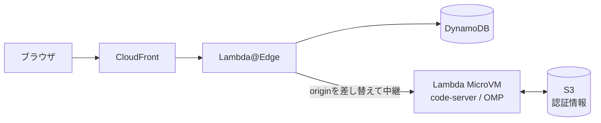
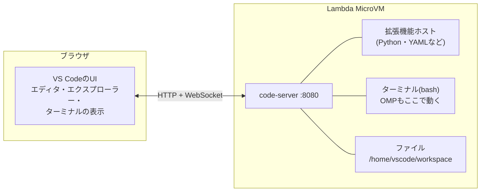
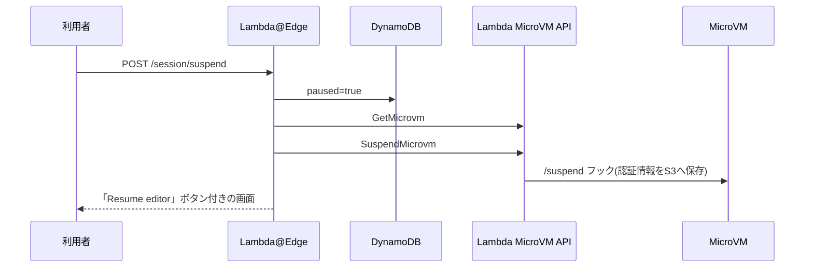
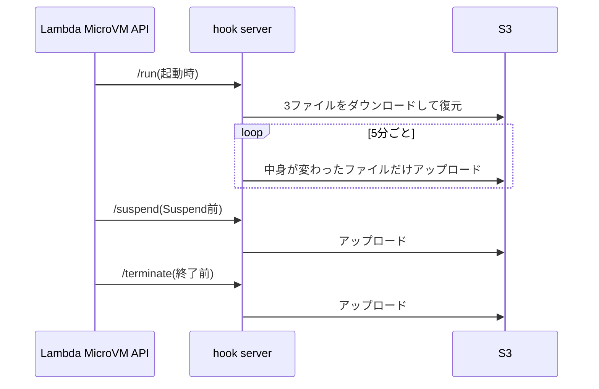

# はじめに
こんにちは、ふくちです。

前回の記事「Lambda MicroVMで自分専用のCloud IDEを作った(AWS構成・認証・接続フロー編)」では、AWS Lambda MicroVMの上にcode-serverとOMP(Oh My Pi)を載せたCloud IDEについて、AWS側の構成を書きました。

おさらいすると、構成はこんな感じです。



今回は少しアプリ寄りの話で、次の3つをまとめます。

- code-serverの画面をどうやってブラウザに写しているのか、なぜリアルタイムに反映されるのか
- 中断(Suspend)と再開(Resume)の仕組み。特に、再開するMicroVMを画面で選べるようにした仕組みとCookieまわり
- code-server上でのOMPとGitHubの認証情報の保持方法

# code-serverの画面はどうやって写っているのか

## 画面を描いているのはブラウザ
code-serverは、VS CodeのUIそのものをブラウザ上で動かしています。サーバー側の画面を画像にして送るVNCやリモートデスクトップとは、仕組みが大きく違います。

code-serverは、coder社が開発しているOSSです。GitHubにあるcode-serverのREADMEには「Run VS Code on any machine anywhere and access it in the browser.」と書かれています。

https://github.com/coder/code-server

VS Codeにはもともと、UIを動かす側と、ファイルやターミナルがある側を分けて動かす仕組みがあります。VS Codeの拡張機能ガイド「Supporting Remote Development and GitHub Codespaces」では、拡張機能を次の2種類に分けて説明しています。

- UI Extensions: テーマやキーマップなど、利用者の手元で動くもの
- Workspace Extensions: ワークスペースと同じマシンで動き、ファイルへのアクセスや言語サービスを提供するもの

https://code.visualstudio.com/api/advanced-topics/remote-extensions

code-serverもこの分け方に沿っていて、今回の構成に当てはめるとこうなります。



画面の描画はブラウザが担当し、MicroVMのcode-serverはファイルの読み書き、ターミナル、拡張機能の処理を担当します。両者はHTTPとWebSocketでやり取りしています。

## なぜリアルタイムに反映されるのか
ブラウザとcode-serverの間には、WebSocketの接続が張りっぱなしになっています。WebSocketはサーバーからもクライアントへ好きなタイミングでデータを送れるので、MicroVM側の変化をすぐにブラウザへ伝えられます。

具体的にはこんな動きになっています。

- キー入力: エディタの表示はブラウザ内で即座に更新されます。保存するとcode-serverがMicroVMのファイルへ書き込みます。今回は`files.autoSave`を`afterDelay`にしているので、少し待つと自動で保存されます。
- ターミナル: 入力した文字がWebSocketでMicroVMのbashへ送られ、出力がWebSocketで返ってきます。OMPの出力が流れてくるように見えるのはこのためです。
- OMPによるファイル編集: OMPがMicroVM上のファイルを書き換えると、code-serverがファイルの変更を検知してブラウザへ通知し、エディタの表示が更新されます。

送っているのはキー入力、ターミナルの文字、ファイルの内容といったデータなので、画面を画像で送る方式と比べて通信量が小さく済みます。AWSのLambda MicroVM開発者ガイドのNetworkingのページによると、今回使っている2GB/1vCPUのMicroVMはendpointの帯域が4MB/sです。テキスト中心のIDEのやり取りなら、この帯域で足りる想定です。

https://docs.aws.amazon.com/lambda/latest/dg/microvms-networking.html

## 通信の経路
前回の記事で書いたとおり、ブラウザとcode-serverの通信はすべてCloudFrontとLambda@Edgeを通ります。

```text
ブラウザ → CloudFront → Lambda@Edge(origin-request) → MicroVM endpoint → code-server :8080
```

WebSocketも最初はHTTPのupgradeリクエストとして送られるので、Lambda@Edgeがこの時点でoriginの差し替えとtokenの付与を行います。接続が確立した後は、その接続の上でデータが流れ続けます。

## MicroVMの中で動かしたアプリを見る
MicroVMの中で`npm run dev`などを実行して`localhost:3000`でアプリを起動した場合、ブラウザからはcode-serverの`/proxy/3000/`というパスで見られます。

```text
ブラウザ → CloudFront → MicroVM endpoint → code-server :8080 → localhost:3000
```

MicroVM endpointのtokenは8080番だけを許可しています。外からの入口はcode-serverだけで、code-serverがMicroVMの中で3000番へ中継しています。

# 中断と再開の仕組み

## Suspendは2種類ある
このCloud IDEには、MicroVMがSuspendされる経路が2つあります。

| 種類 | きっかけ | 再開のされ方 |
| --- | --- | --- |
| 自動Suspend | MicroVM endpointへの通信が5分間なかった | 次にURLを開くと、AWSが自動で再開する |
| 明示Suspend | 利用者がボタンを押した | 利用者が再開ボタンを押すまで再開しない |

自動Suspendは、`RunMicrovm`のidle policy(`maxIdleDurationSeconds: 300`、`autoResumeEnabled: true`)でAWSがやってくれます。AWSのLambda MicroVM開発者ガイドによると、自動再開のときLambdaは届いたリクエストを保留し、再開が終わってからアプリへ渡してくれます。

https://docs.aws.amazon.com/lambda/latest/dg/microvms-launching.html

## 明示Suspendが必要だった理由
自動Suspendがあるなら十分では、と最初は思っていました。ところがcode-serverのタブを開いたままにしておくと、WebSocketの通信が続くのでアイドル扱いになりません。

じゃあSuspend APIを呼べばいいかというと、今度は`autoResumeEnabled: true`が邪魔をします。Suspendした直後にcode-serverのWebSocketが再接続しにくると、その通信でMicroVMが自動再開してしまうんですね。止めたつもりでも止まっていない、という状態になります。

そこで、Lambda@Edge側で「この利用者は明示的に止めた」という状態を持ち、その間はMicroVMへの通信自体をLambda@Edgeで止めることにしました。DynamoDBのセッションのレコードに`paused`というフラグを持たせています。

## Suspendボタン
Suspendボタンは、code-serverのステータスバーに出しています。これは自作のVS Code拡張で、やっていることはURLを開くだけです。

```js:omp-cloud-ide-controls/extension.js
function activate(context) {
  const rawUrl = vscode.workspace.getConfiguration('ompCloudIde').get('controlUrl', '');
  let controlUrl;
  try {
    controlUrl = new URL(rawUrl);
  } catch {
    controlUrl = undefined;
  }

  const status = vscode.window.createStatusBarItem(vscode.StatusBarAlignment.Left, 100);
  status.text = '$(debug-pause) Suspend Cloud IDE';
  status.command =
    controlUrl?.protocol === 'https:'
      ? { command: 'vscode.open', title: 'Open Cloud IDE controls', arguments: [controlUrl.toString()] }
      : 'ompCloudIde.openControl';
  status.show();
  // 省略
}
```

開く先の`/session/control`は、Lambda@Edgeが返す制御画面です。この拡張はMicroVMの中で動きますが、AWSの権限は持っていません。Suspend APIを呼ぶのは、あくまでMicroVMの外にいるLambda@Edgeです。

MicroVMの中から自分自身を止める作りにすると、止まる途中で応答が返せなくなったり、上で書いた再接続の問題が起きたりします。外側のLambda@Edgeから止める方が、状態をきれいに管理できます。

## Suspendの流れ
制御画面で「Suspend Cloud IDE」を押すと、こう動きます。



大事なのは、Lambda@EdgeがSuspend APIを呼ぶ前に`paused=true`を書き込むことです。こうしておくと、Suspend要求の直後にcode-serverが再接続してきても、Lambda@EdgeがMicroVM endpointへ届く前に止められます。

`paused=true`の間、Lambda@Edgeはエディタ宛てのリクエストにこう返します。

```js:artifact/edge/index.js
function pausedSessionResponse(headers) {
  if (isHtmlNavigation(headers)) {
    return redirectToControl(); // 302 /session/control
  }
  return {
    status: '409',
    statusDescription: 'Conflict',
    headers: {
      'cache-control': [{ key: 'Cache-Control', value: 'no-store' }],
      'content-type': [{ key: 'Content-Type', value: 'text/plain; charset=utf-8' }],
      'retry-after': [{ key: 'Retry-After', value: '5' }],
    },
    body: 'Cloud IDE is paused. Open /session/control to resume.',
  };
}
```

画面遷移(`Accept`に`text/html`を含むリクエスト)なら制御画面へリダイレクトし、それ以外のWebSocketやAPIのリクエストには409を返します。どちらの場合もMicroVMには何も届かないので、自動再開も起きません。

## Resumeの流れ
制御画面で「Resume editor」を押すと、Lambda@Edgeは`ResumeMicrovm`を呼んでから`paused=false`に戻し、5秒後にエディタへ移動する画面を返します。

AWSのLambda MicroVM開発者ガイドには、Resume時にメモリとディスクの状態がSuspend時点に戻ると書かれています。なので、ターミナルで動いていたプロセスや、OMPとの会話もそのまま続きから使えます。ここはLambda MicroVMのいいところですね。

## 残り時間をステータスバーに出す
Suspendしても、MicroVMは起動から8時間で終了します。気づかないうちにpushしていない変更ごと消えるのは避けたいので、ステータスバーに`残り H:MM`を出すことにしました。

ただ、MicroVMの中からは自分の起動時刻がわかりません。`GetMicrovm`の権限も渡していませんし、起動時刻の環境変数もありません。そこでLambda@Edgeが`RunMicrovm`の直前に「今+8時間」を`expiresAt`として計算し、`runHookPayload`に`{"sessionId", "expiresAt"}`を入れて渡しています。直前に計算するので、実際の終了時刻より遅くなることはありません。

Lambdaは`/run`フックの本文を`{"microvmId": ..., "runHookPayload": "<文字列>"}`という形で届けます。`lifecycle.py`はこの外側を開いて`expiresAt`を取り出し、`~/.cache/omp-cloud-ide/session.json`に`{microvmId, expiresAt}`だけを書きます。`sessionId`はCookieの値そのものなので、MicroVMの中には残しません。

拡張はこのファイルを読んで、残り30分で黄色、10分で赤にし、残り60分・15分・5分でcommitとpushを促す通知を出します。クリックするとソース管理のビューが開きます。MicroVMの時計はNTPで合わせられていないので、S3のリージョンendpointへのHEADで返る`Date`ヘッダーとの差を1分ごとに測って補正しています。実際に3分Suspendしてから再開したときの補正量は-1秒で、再開後に時計がずれる様子は見られませんでした。`session.json`がない場合は推測せず、`残り時間不明`と出します。

# 再開するMicroVMをどうやって選ばせているか

## Cookieは2種類
このCloud IDEでは、役割の違う2つのCookieを使っています。

| Cookie | 値 | 役割 |
| --- | --- | --- |
| `omp-cloud-ide-auth` | 有効期限とHMAC署名 | ログインしているかを表す |
| `mvm-session` | ランダムなUUID | どのMicroVMへつなぐかを表す |

どちらも`Secure; HttpOnly; SameSite=Strict`で発行しています。

ポイントは、`mvm-session`にはUUIDしか入れていないことです。このUUIDはDynamoDBのレコードのキーで、MicroVM ID、endpoint、tokenはDynamoDB側にあります。Cookieはただの「指し示す先」なので、Cookieの値を別のUUIDに書き換えれば、そのまま接続先の切り替えになります。

## セッション選択画面
ログインすると、Lambda@Edgeはまずセッション選択画面(`/session/select`)を出します。ここで既存のMicroVMへ接続するか、新しく起動するかを選びます。

画面の中身は、Lambda@Edgeが次の手順で作っています。

1. DynamoDBを25件ずつ全ページScanする。endpointとtokenは読まない
2. それぞれのMicroVMに`GetMicrovm`を並列で投げて状態を確認する
3. `TERMINATED`やNotFoundの行はID一致を条件に削除し、`TERMINATING`は終了まで隠す
4. 作成日時の新しい順に並べる
5. 追跡中のMicroVMごとに接続と確認付きTerminateのボタンを作る
6. `ListMicrovms`の全ページからセッション行のないVMを「Untracked MicroVMs」に出す。ただし起動中も一時的に現れるため、画面内で直接Terminateさせない

```js:artifact/edge/index.js
const items = [];
let lastKey;
do {
  const result = await ddb.send(new ScanCommand({
    TableName: cfg.TABLE,
    ProjectionExpression: 'sessionId,microvmId,paused,terminationPending,createdAt,#ttl',
    ExpressionAttributeNames: { '#ttl': 'ttl' },
    Limit: 25,
    ExclusiveStartKey: lastKey,
  }));
  items.push(...(result.Items ?? []));
  lastKey = result.LastEvaluatedKey;
} while (lastKey);
```

この後、各行の`GetMicrovm`を並列実行し、終了済み行を条件付きで削除してから表示用に並べます。

DynamoDBのレコードだけを信じない、というのがここの考え方です。DynamoDBのTTLによる削除はすぐには行われないので、終了したMicroVMのレコードがしばらく残ります。最終的な状態はLambda MicroVMのAPIに聞いて判断しています。

各カードは、hiddenのinputを持つただのHTMLフォームです。

```js:artifact/edge/index.js
'<form method="post" action="/session/select">',
'<input type="hidden" name="action" value="attach">',
`<input type="hidden" name="sessionId" value="${escapeHtml(session.sessionId)}">`,
`<button class="primary" type="submit">${actionLabel}</button>`,
'</form>',
```

ボタンの文言は、MicroVMがSUSPENDEDか`paused=true`なら「Resume and connect」、それ以外は「Connect」にしています。今のブラウザの`mvm-session`と同じセッションには「Currently selected in this browser」と表示するので、どれが今つながっているMicroVMかもわかります。

カードには、`GetMicrovm`の`startedAt`と`maximumDurationInSeconds`から計算した終了予定時刻も`Ends <ISO時刻> (Xh Ym left)`の形で出しています。つなぐ前に、そのMicroVMがあとどれくらい使えるかがわかります。

## 選んだときの処理
カードのボタンを押すと、`POST /session/select`(`action=attach`)が飛びます。Lambda@Edgeは次の順で処理します。

1. `sessionId`の形式を確認する
2. DynamoDBを強い整合性で読み直す
3. `GetMicrovm`で今の状態を確認し、状態ごとに分岐する

| MicroVMの状態 | Lambda@Edgeの応答 |
| --- | --- |
| RUNNING | `paused=false`にして、`mvm-session`を選んだUUIDで上書きし、`/`へ303 |
| SUSPENDED | `ResumeMicrovm`を呼び、`paused=false`にして、`mvm-session`を上書きし、再開中の画面を返す |
| SUSPENDING | 「Suspend中なので少し待って」と表示する |
| TERMINATED / TERMINATING | 「終了済み」と表示する |

この仕組みのおかげで、別のPCやスマホからでも、ログインさえすれば同じMicroVMの続きを開けます。ブラウザのCookieを消してしまっても、選択画面から選び直せば元のMicroVMに戻れます。

## Cookieを消してはいけなかった話
この選択画面を作ったきっかけは、初期実装で起きた事故でした。

以前のorigin-responseのLambda@Edgeは、MicroVMから502や504が返ってくると、「MicroVMが消えた」と判断して`mvm-session`を削除し、新規起動の処理へ送っていました。ところがMicroVMは、Resumeの途中などで一時的に502/504を返すことがあります。AWSのLambda MicroVM開発者ガイドにも、自動再開が成功しなかった場合は502を返すと書かれています。

その結果、MicroVMも作業中のファイルも生きているのに、ブラウザからは新しいMicroVMしか起動できない、という状態になりました。

今のorigin-responseは、Cookieを残したまま選択画面へ戻すだけにしています。

```js:artifact/edge-response/index.js
exports.handler = async (event) => {
  const { request, response } = event.Records[0].cf;
  const status = parseInt(response.status, 10);
  const recoverable = status === 502 || status === 504;

  if (recoverable && hasMvmSessionCookie(request.headers) && isHtmlNavigation(request.headers)) {
    return {
      status: '302',
      statusDescription: 'Found',
      headers: {
        location: [{ key: 'Location', value: '/session/select' }],
        'cache-control': [{ key: 'Cache-Control', value: 'no-store' }],
      },
    };
  }
  return response;
};
```

画面遷移のときだけ選択画面へ戻し、CSSやJavaScript、WebSocketの502/504はそのまま返します。サブリソースまでリダイレクトすると、画面がかえって壊れるからです。選択画面ではMicroVMの本当の状態をAPIで確認するので、利用者は同じMicroVMにつなぎ直すか、新しく起動するかを自分で選べます。

状態を壊す判断(今回はCookieの削除)をする前に、正しい情報源(Lambda MicroVMのAPI)で確認し直す。これが今回の一番の学びでした。

## JavaScriptを使わない画面
Lambda@Edgeが返すログイン画面、選択画面、制御画面には、次のCSPを付けています。

```text
default-src 'none'; style-src 'unsafe-inline'; form-action 'self'; base-uri 'none'; frame-ancestors 'none'
```

scriptを一切許可していないので、画面の操作は全部HTMLフォームのPOSTで、起動中・再開中の画面から先への移動は`<meta http-equiv="refresh" content="5;url=/">`で行っています。Cookieは`HttpOnly`なのでJavaScriptから触る必要もなく、この画面はサーバー側だけで完結しています。制御画面だけは、code-serverのタブの中で開けるよう`frame-ancestors 'self'`にしています。

## 今の制約
個人用なので割り切っているところもあります。

- DynamoDB Scanは全ページ読むが、MicroVMごとに`GetMicrovm`を呼ぶため、セッションが増えるとEdgeの30秒上限やAPI throttlingが問題になります
- PENDINGのMicroVMにも接続ボタンを出していて、code-serverの準備完了までは確認していません
- Untracked MicroVMは画面に表示するだけです。起動中の一時的不整合と区別できず、Scanで所有権を原子的に確認できないため、IDを再確認してAWS API/Consoleで終了します
- 追跡中のセッションは、確認画面でMicroVM ID全文を入力してTerminateできます。結果が曖昧でも`terminationPending`で通信を止め、終了確認後にDDB行を削除します

# code-server上での認証情報の保持(OMPとGitHub)

## 何が問題か
MicroVMは起動から最大8時間で終了し、次に起動するMicroVMはImageのスナップショットから始まります。何もしなければ、OMPでログインしたClaudeやCodexのOAuth情報も、`gh auth login`したGitHubの情報も、MicroVMと一緒に消えてしまいます。毎回ログインし直すのは、さすがに面倒です。

## 選んだ方法: 認証ファイルだけをS3へ退避する
考えた案はこの3つです。

| 案 | 内容 | 判断 |
| --- | --- | --- |
| Auth Broker | 認証情報を管理する常駐サーバーをEC2で立てる | 個人用には費用と運用が重いので見送り |
| ホームディレクトリ全体を保存 | `/home/vscode`をまるごとS3へ保存・復元する | 容量、復元時間、secretの混入、複数MicroVMでの競合が気になるので見送り |
| 認証ファイルだけを保存 | OMPとGitHub CLIの認証ファイルだけをS3へ保存・復元する | 採用 |

ソースコードはGitHubへpushして残す前提なので、MicroVMをまたいで持ち越すのは認証情報だけで十分でした。

対象のファイルは3つです。

| MicroVM内のパス | 中身 |
| --- | --- |
| `~/.omp/agent/agent.db` | OMPのSQLite DB。Anthropic、OpenAI CodexなどのOAuth情報が入る |
| `~/.omp/install-id` | OMPのインストールID |
| `~/.config/gh/hosts.yml` | GitHub CLIのログイン情報 |

保存先のS3バケットは、専用のKMSキーで暗号化し、Versioning、パブリックアクセスのブロック、SSL必須を有効にしています。スタックを消してもバケットとキーは残るよう、RETAINにしました。

## GitHub CLIのtokenがhosts.ymlに入る理由
GitHub CLIのマニュアル(`gh auth login`)には、tokenはOSのcredential storeに保存し、credential storeが見つからない場合は平文のファイルに書き込むと書かれています。

https://cli.github.com/manual/gh_auth_login

このMicroVMのImageにはcredential storeを入れていないので、tokenは`hosts.yml`に書き込まれます。今回はこの挙動に乗って、`hosts.yml`をS3に退避しています。

gitのcommitやpushでもこのtokenを使えるよう、Dockerfileでgitのcredential helperをGitHub CLIに向けています。

```dockerfile:Dockerfile
RUN git config --system credential.https://github.com.helper '!gh auth git-credential'
```

## 保存と復元のタイミング
保存と復元は、前回の記事で紹介したライフサイクルフックのサーバー(`lifecycle.py`)が担当します。



`/run`フックが200を返すまで、MicroVM endpointはcode-serverへ通信を流しません。なので、ブラウザでcode-serverが開いた時点で、OMPとGitHubのログイン状態はもう戻っています。

終了時の`/terminate`フックだけに頼ると、異常終了のときに保存できません。そのため5分ごとの定期保存も動かしています。ただし毎回送るわけではなく、前回保存したときのSHA-256と比べて、中身が変わったファイルだけをアップロードします。バケットはVersioningを有効にしているので、これで新しいversionが増えるのは認証情報が実際に変わったときだけになります。古いversionは、S3のライフサイクルルールで30日たったものから消しています(新しい10個は日数に関係なく残します)。加えて、ログイン直後にすぐ保存したいときのために、`persist-auth-state`という手動保存コマンドも用意しました。

## SQLiteは安全にコピーする
OMPの`agent.db`はSQLiteのDBで、OMPが動いている間は書き込みが起きる可能性があります。ファイルをそのまま`cp`すると、書き込み途中の壊れたDBを保存してしまうかもしれません。

そこで、PythonのSQLiteのbackup APIで一貫性のある複製を作ってから、その複製をアップロードしています。

```python:lifecycle.py
def sqlite_snapshot(source: Path, destination: Path) -> None:
    source_uri = f"file:{source}?mode=ro"
    with sqlite3.connect(source_uri, uri=True, timeout=5) as source_db:
        with sqlite3.connect(destination) as backup_db:
            source_db.backup(backup_db)
```

復元するときも、対象のファイルへ直接ダウンロードはしません。同じディレクトリの一時ファイルへダウンロードし、権限を`0600`にしてから`os.replace`で置き換えます。途中で失敗しても、既存のファイルが中途半端に上書きされることはありません。

```python:lifecycle.py
with tempfile.NamedTemporaryFile(dir=target.parent, delete=False) as tmp:
    temp_path = Path(tmp.name)
try:
    meta = run_aws(deadline, None, "s3api", "get-object",
                   "--bucket", BUCKET, "--key", f"{PREFIX}/{key}", str(temp_path))
    os.chmod(temp_path, 0o600)
    os.replace(temp_path, target)
    files[key] = {"sha256": file_sha256(target), "etag": meta.get("ETag"), "versionId": meta.get("VersionId")}
except SyncError as error:
    if error.code == "NoSuchKey":
        files[key] = {"missing": True}  # 初回起動。最初の保存は新規作成だけにする
    else:
        failed.append(key)
finally:
    temp_path.unlink(missing_ok=True)
```

`aws s3 cp`ではなく`aws s3api get-object`を使っているのは、戻したオブジェクトのETagとVersionIdを記録するためです。ETagは後で書く楽観ロックに使います。

`NoSuchKey`は初回起動なので正常です。それ以外の理由で復元できなかったファイルは`restoreFailed`に入れ、自動保存では送らないようにしています。復元に失敗したMicroVMのローカルファイルは未ログインの状態なので、それでS3の正しい認証情報を上書きしてしまわないためです。ログインし直して`persist-auth-state`を実行すると、この制限は外れます。このときはETagがわからないので、手動保存に限って無条件で書き込みます。

## 保存の結果をステータスバーに出す
最初の実装では、保存に失敗してもhook serverのログに出るだけでした。ところが調べてみると、実行中のMicroVMの標準出力(`[lifecycle]`の行)はCloudWatch Logsに届いていませんでした。Imageに設定したロググループに残るのは、Imageのbuildと検証のときの出力だけです。つまり、失敗しても誰も気づけない状態でした。

そこで`lifecycle.py`は、復元と保存のたびに結果を`~/.cache/omp-cloud-ide/auth-sync.json`へ書き、自作拡張がそれをステータスバーに出すようにしました。普段は最後に保存できた時刻を`認証 N分前`と表示し、同期間隔の3倍(15分)より古いか記録がなければ警告色にします。失敗したときは`認証保存失敗`、`認証復元失敗`、`認証競合`をエラー色で出します。クリックすると`persist-auth-state`が動き、結果が通知で返ってきます。

フック自体はfail-openのままです。`/run`は25秒、`/suspend`と`/terminate`は40秒の中で処理を終わらせ、AWS CLIの呼び出しも1回ごとに残り時間で打ち切ります。S3に届かなくてもフックは200を返すので、MicroVMの起動やSuspendが止まることはありません。定期保存、フック、手動保存は`flock`のロックで1つずつ動かし、フックが待っているときは定期保存の通信を打ち切ってフックを優先させます。

## 複数のMicroVMからの書き込みはETagで守る
すべてのMicroVMは同じS3のキーへ書き込みます。何もしないと、古い認証情報を持ったMicroVMが、別のMicroVMで更新されたばかりのOAuth tokenを上書きしてしまいます。

そこでS3の条件付き書き込みで、ETag楽観ロックをかけました。`/run`で記録したETag(オブジェクトがなかった場合は「なし」)を使い、保存するときは`put-object --if-match <ETag>`、オブジェクトがなかったキーは`--if-none-match '*'`を付けます。成功したら新しいETagを覚えておきます。

S3が412(PreconditionFailed)を返したら、別のMicroVMが先に書いたということです。そのキーを`conflicts`に入れてステータスバーに`認証競合`を出し、以後の自動保存では送りません。409(ConditionalRequestConflict)は一時的な衝突なので、次の同期で再試行します。

手動の`persist-auth-state`も条件付きで書くので、競合中はやはり失敗します。このMicroVMの認証情報で上書きしてよいと判断したときだけ、`persist-auth-state --overwrite`で無条件に書き込み、競合を解除します。実際のExecution Roleとバケットで、新規作成、別の書き込み後の競合、手動保存でも競合のまま(終了コード1)、`--overwrite`で成功、の流れを確認しました。

## 初回のログイン手順
初めて使うときは、code-serverのターミナルでOMPとGitHub CLIにログインします。

```text
omp
/login anthropic
/login openai-codex
```

```bash
gh auth login --hostname github.com --git-protocol https --web
gh auth setup-git
persist-auth-state
```

`gh auth login --web`は、ターミナルにワンタイムコードを表示し、利用者が手元のブラウザでGitHubのページを開いてコードを入力する方式です。MicroVM側でlocalhostのcallbackを受ける必要がないので、リモートの環境と相性が良いです。

一方でOMPのOAuthは、ログイン中にMicroVMの中でlocalhostのcallbackを待ち受けることがあります。code-serverが「port 1455が使えます」のような通知を出しますが、code-serverの`/proxy/1455/`はOAuth providerに登録されているredirect URIと一致しないので、そのURLではcallbackが届きません。この場合は、providerが表示する認可コードや、最後にリダイレクトされたURLをOMPへ貼り付けて完了させます。

ログインが終わったら、`persist-auth-state`ですぐS3へ保存しておくと安心です。ファイルごとの結果を表示し、失敗したファイルがあれば0以外の終了コードで終わります。

## 注意点
この方式にも弱いところがあります。

- フックはfail-openなので、S3に保存できなくてもMicroVMのSuspendや終了は進みます。失敗はステータスバーで気づけますが、終了直前の保存に失敗した分は取り戻せません。また、手動保存がロックを持っている間(最大2分ほど)にSuspendされると、`/suspend`フックが待ちきれずに保存を飛ばすことがあります。
- 競合を検知して上書きを止めるところまでで、別のMicroVMが保存した新しい認証情報を競合中のMicroVMへ取り込む仕組みはありません。ログインし直すか、新しいMicroVMを起動します。また、この変更より前のImageで起動したMicroVMは、今も無条件で書き込みます。
- 認証ファイルはUID 1000で読めるので、MicroVMで動かしたコードからも読めます。知らないリポジトリをそのまま動かす用途には向きません。

1人で使う前提なら、この弱点は運用でカバーできます。複数人で使うようになったら、Auth Brokerを検討するつもりです。

# まとめ
今回はCloud IDEのアプリ寄りの部分をまとめました。

- code-serverはVS CodeのUIをブラウザで動かし、ファイル・ターミナル・拡張機能をMicroVMで動かす。両者をWebSocketでつないでいるので、変化がすぐ画面に反映される
- 明示Suspendでは、Lambda@EdgeがSuspend APIより先に`paused=true`を書き、エディタの通信を止めることで自動再開を防ぐ
- 接続先はCookieにUUIDだけを入れ、選択画面でそのUUIDを上書きすることで、どの端末からでも同じMicroVMへ戻れる
- 一時的な502/504ではCookieを消さず、Lambda MicroVMのAPIで状態を確かめてから利用者に選ばせる
- OMPとGitHub CLIの認証ファイルだけをS3へ退避し、`/run`フックで復元する。保存は変わったファイルだけをETag楽観ロック付きで行い、結果はステータスバーに出す
- MicroVMの残り寿命は、Lambda@Edgeが`runHookPayload`で渡した`expiresAt`から`残り H:MM`として表示する

Lambda MicroVMはSuspendとResumeでメモリごと戻ってくれるので、ちゃんと作ると「PCを閉じて、別のPCで開いたら続きから」がそのままできます。個人的にはかなり体験が良いです。

## 参考リンク

https://github.com/coder/code-server

https://coder.com/docs/code-server/FAQ

https://code.visualstudio.com/api/advanced-topics/remote-extensions

https://docs.aws.amazon.com/lambda/latest/dg/microvms-launching.html

https://docs.aws.amazon.com/lambda/latest/dg/microvms-networking.html

https://cli.github.com/manual/gh_auth_login

https://docs.python.org/3/library/sqlite3.html#sqlite3.Connection.backup
